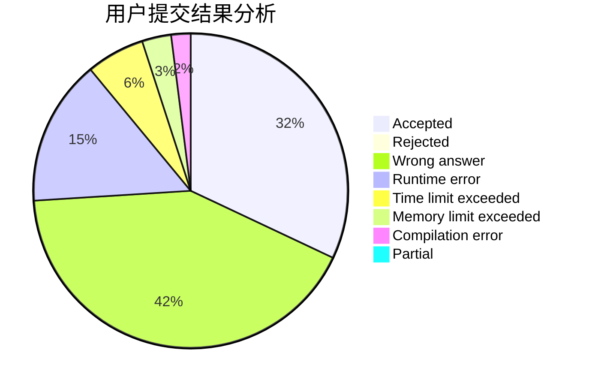
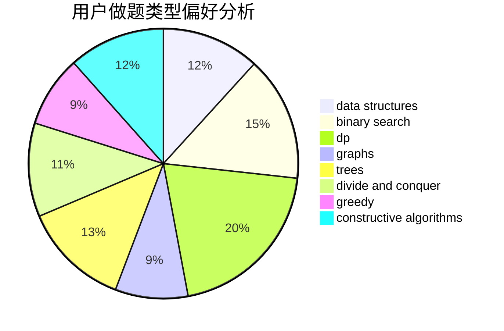
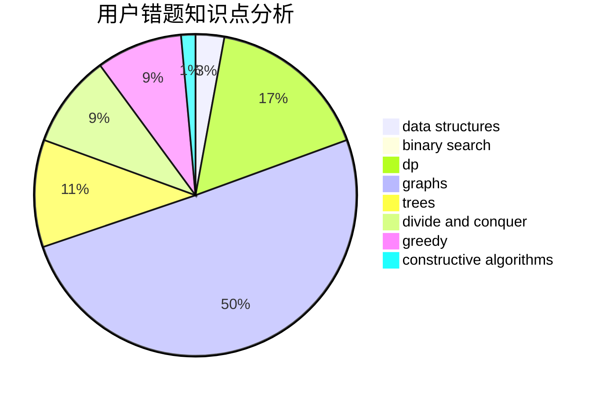

# Tohsaka_Sakura

<!-- tabs:start -->

#### **用户提交结果分析**

#### **用户做题类型偏好分析**

#### **用户错题知识点分析**

<!-- tabs:end -->
# 推荐题目
[1119B](https://codeforces.com/contest/1119/problem/B)		binary search,
                        flows,
                        greedy,
                        sortings		  
[291A](https://codeforces.com/contest/291/problem/A)		*special problem,
                        implementation,
                        sortings		  
[1341E](https://codeforces.com/contest/1341/problem/E)		dsu,graphs,sortings,trees		  
[842C](https://codeforces.com/contest/842/problem/C)		dfs and similar,
                        graphs,
                        math,
                        number theory,
                        trees		  
[1194E](https://codeforces.com/contest/1194/problem/E)		bitmasks,
                        brute force,
                        data structures,
                        geometry,
                        sortings		  
[622C](https://codeforces.com/contest/622/problem/C)		data structures,
                        implementation		  
[555D](https://codeforces.com/contest/555/problem/D)		binary search,
                        implementation,
                        math		  
[1179D](https://codeforces.com/contest/1179/problem/D)		data structures,
                        dp,
                        trees		  
[512C](https://codeforces.com/contest/512/problem/C)		dsu,graphs,sortings,trees		  
[142B](https://codeforces.com/contest/142/problem/B)		constructive algorithms,
                        greedy,
                        implementation		  
