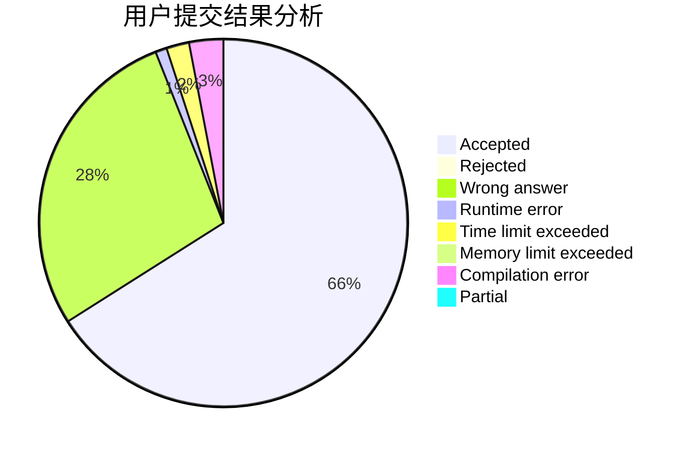
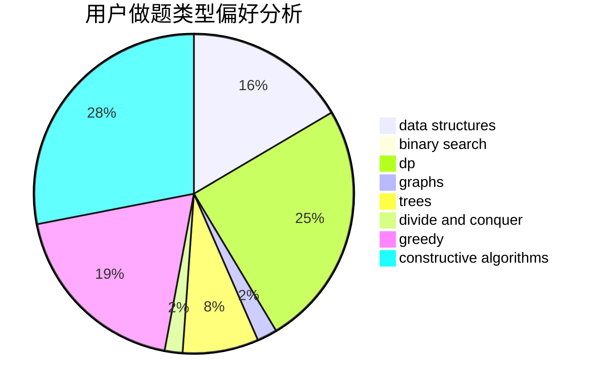
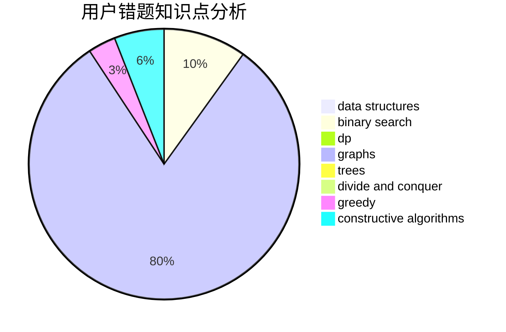

# Tom66

<!-- tabs:start -->

#### **用户提交结果分析**

#### **用户做题类型偏好分析**

#### **用户错题知识点分析**

<!-- tabs:end -->
# 推荐题目
[1473G](https://codeforces.com/contest/1473/problem/G)		combinatorics,
                        dp,
                        fft,
                        math		  
[249E](https://codeforces.com/contest/249/problem/E)		math		  
[13571](https://codeforces.com/contest/1357/problem/1)		dsu,graphs,sortings,trees		  
[1103B](https://codeforces.com/contest/1103/problem/B)		binary search,
                        constructive algorithms,
                        interactive		  
[313C](https://codeforces.com/contest/313/problem/C)		constructive algorithms,
                        greedy,
                        implementation,
                        sortings		  
[594D](https://codeforces.com/contest/594/problem/D)		data structures,
                        number theory		  
[69E](https://codeforces.com/contest/69/problem/E)		data structures,
                        implementation		  
[1221E](https://codeforces.com/contest/1221/problem/E)		games		  
[29B](https://codeforces.com/contest/29/problem/B)		implementation		  
[1360E](https://codeforces.com/contest/1360/problem/E)		dp,
                        graphs,
                        implementation,
                        shortest paths		  
