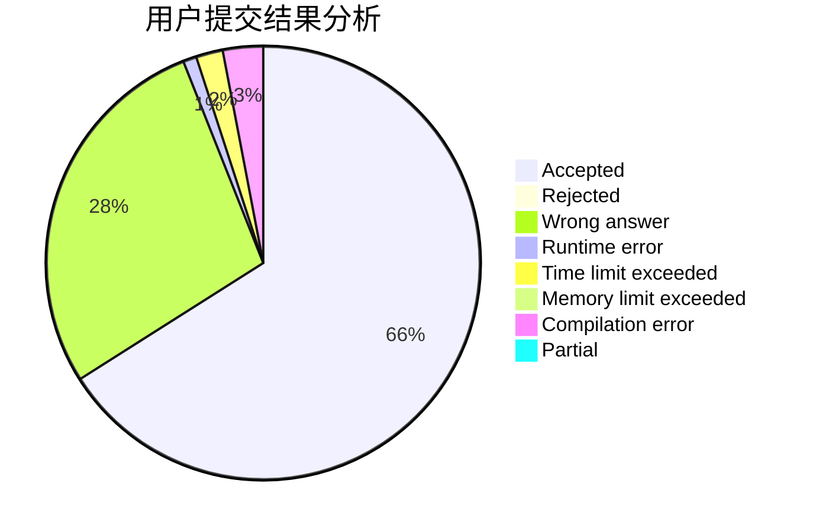
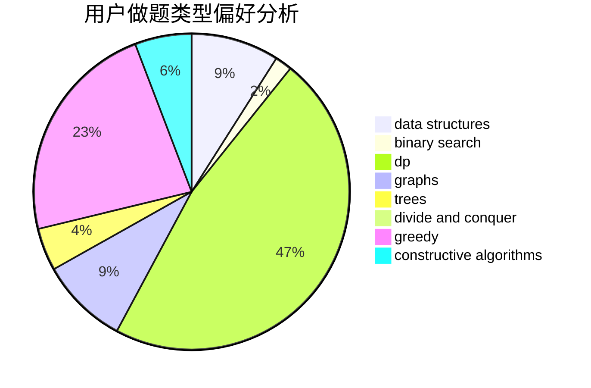
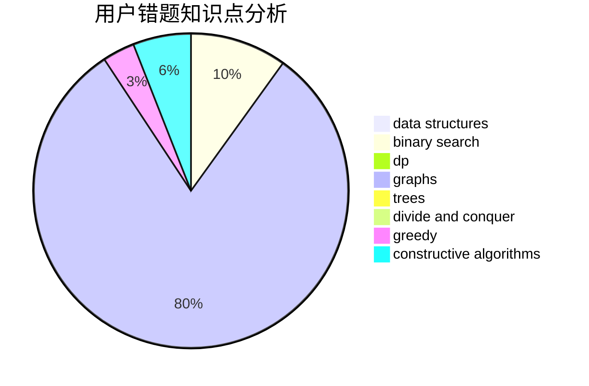

# Tom66

<!-- tabs:start -->

#### **用户提交结果分析**

#### **用户做题类型偏好分析**

#### **用户错题知识点分析**

<!-- tabs:end -->
# 推荐题目
[1466G](https://codeforces.com/contest/1466/problem/G)		combinatorics,
                        divide and conquer,
                        hashing,
                        math,
                        string suffix structures,
                        strings		  
[229D](https://codeforces.com/contest/229/problem/D)		dp,
                        greedy,
                        two pointers		  
[1349F1](https://codeforces.com/contest/1349F/problem/1)		dp,
                        fft,
                        math		  
[1102E](https://codeforces.com/contest/1102/problem/E)		combinatorics,
                        sortings		  
[296B](https://codeforces.com/contest/296/problem/B)		combinatorics,
                        dp		  
[574C](https://codeforces.com/contest/574/problem/C)		dsu,graphs,sortings,trees		  
[675B](https://codeforces.com/contest/675/problem/B)		brute force,
                        constructive algorithms,
                        math		  
[1216A](https://codeforces.com/contest/1216/problem/A)		strings		  
[283B](https://codeforces.com/contest/283/problem/B)		dfs and similar,
                        dp,
                        graphs		  
[1354A](https://codeforces.com/contest/1354/problem/A)		math		  
