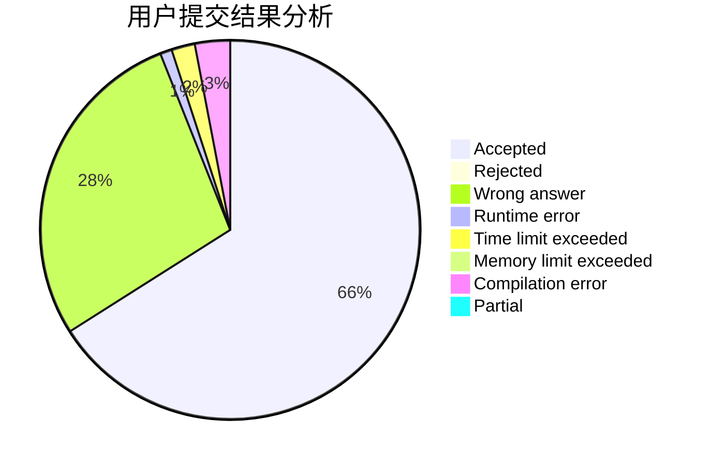
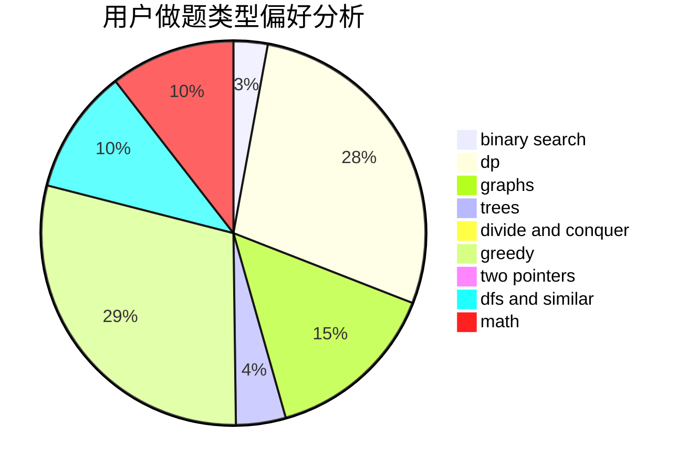

# Tom66

<!-- tabs:start -->

#### **用户提交结果分析**

#### **用户做题类型偏好分析**

<!-- tabs:end -->
# 推荐题目
[1473G](https://codeforces.com/contest/1473/problem/G)
[249E](https://codeforces.com/contest/249/problem/E)
[13571](https://codeforces.com/contest/1357/problem/1)
[1103B](https://codeforces.com/contest/1103/problem/B)
[313C](https://codeforces.com/contest/313/problem/C)
[594D](https://codeforces.com/contest/594/problem/D)
[69E](https://codeforces.com/contest/69/problem/E)
[1221E](https://codeforces.com/contest/1221/problem/E)
[29B](https://codeforces.com/contest/29/problem/B)
[1360E](https://codeforces.com/contest/1360/problem/E)
