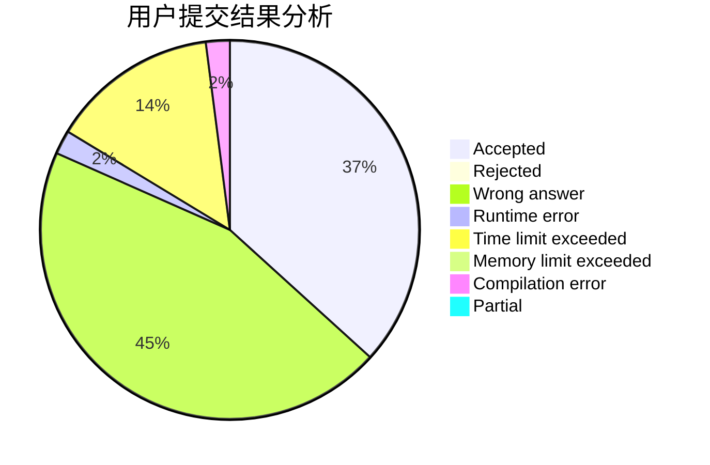
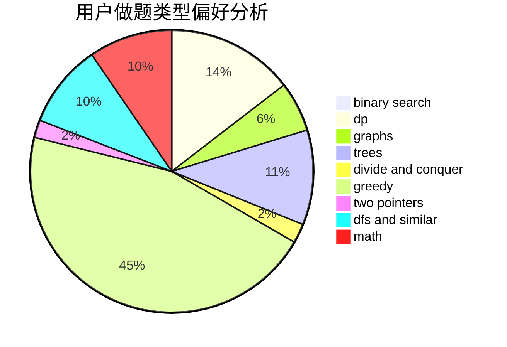

# Tom_Liu

<!-- tabs:start -->

#### **用户提交结果分析**

#### **用户做题类型偏好分析**

<!-- tabs:end -->
# 推荐题目
[1388B](https://codeforces.com/contest/1388/problem/B)
[1425B](https://codeforces.com/contest/1425/problem/B)
[1C](https://codeforces.com/contest/1/problem/C)
[1310D](https://codeforces.com/contest/1310/problem/D)
[777D](https://codeforces.com/contest/777/problem/D)
[696B](https://codeforces.com/contest/696/problem/B)
[571C](https://codeforces.com/contest/571/problem/C)
[421B](https://codeforces.com/contest/421/problem/B)
[600E](https://codeforces.com/contest/600/problem/E)
[1267F](https://codeforces.com/contest/1267/problem/F)
