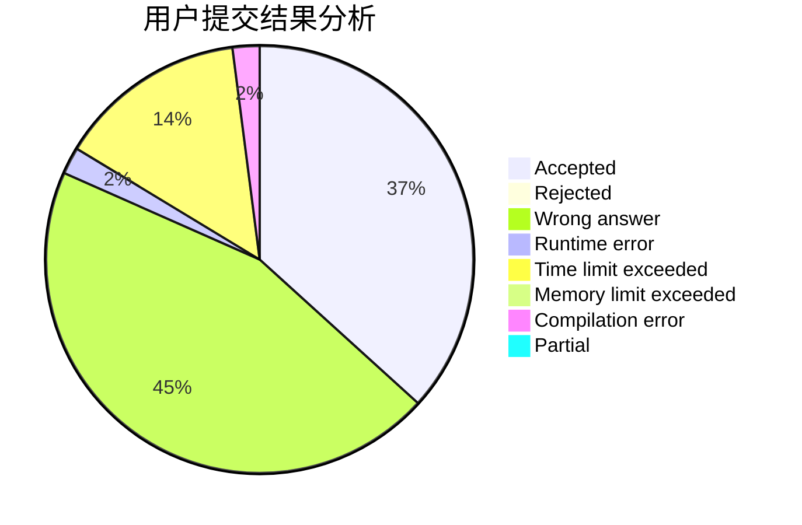
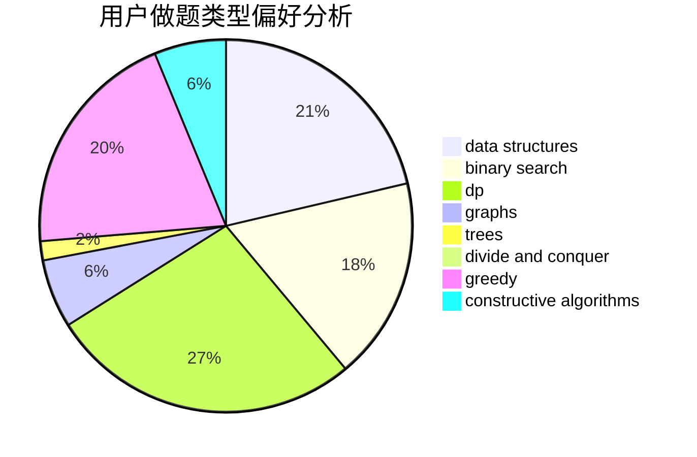
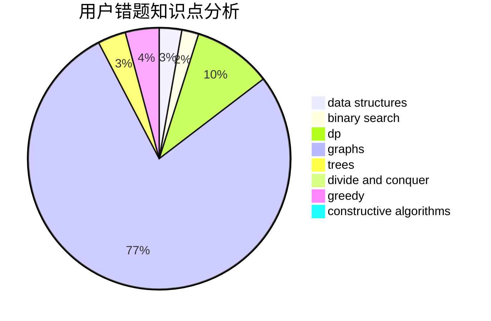

# Tom_Liu

<!-- tabs:start -->

#### **用户提交结果分析**

#### **用户做题类型偏好分析**

#### **用户错题知识点分析**

<!-- tabs:end -->
# 推荐题目
[1379B](https://codeforces.com/contest/1379/problem/B)		binary search,
                        brute force,
                        math,
                        number theory		  
[1417E](https://codeforces.com/contest/1417/problem/E)		dsu,graphs,sortings,trees		  
[174C](https://codeforces.com/contest/174/problem/C)		data structures,
                        greedy		  
[1301A](https://codeforces.com/contest/1301/problem/A)		implementation,
                        strings		  
[758D](https://codeforces.com/contest/758/problem/D)		constructive algorithms,
                        dp,
                        greedy,
                        math,
                        strings		  
[670D1](https://codeforces.com/contest/670D/problem/1)		binary search,
                        brute force,
                        implementation		  
[547A](https://codeforces.com/contest/547/problem/A)		brute force,
                        greedy,
                        implementation,
                        math		  
[393C](https://codeforces.com/contest/393/problem/C)		dsu,graphs,sortings,trees		  
[580C](https://codeforces.com/contest/580/problem/C)		dfs and similar,
                        graphs,
                        trees		  
[1261E](https://codeforces.com/contest/1261/problem/E)		dsu,graphs,sortings,trees		  
