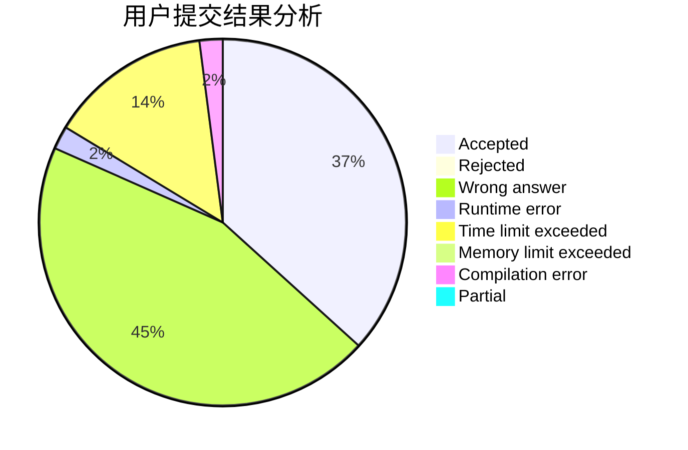
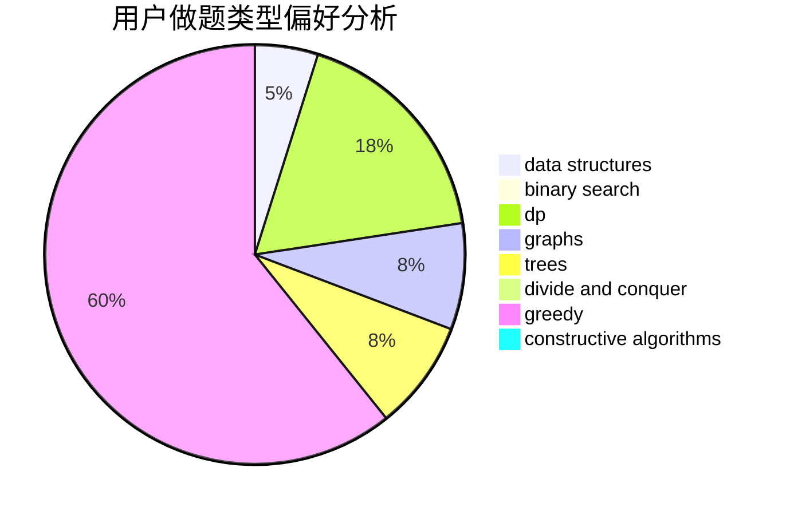
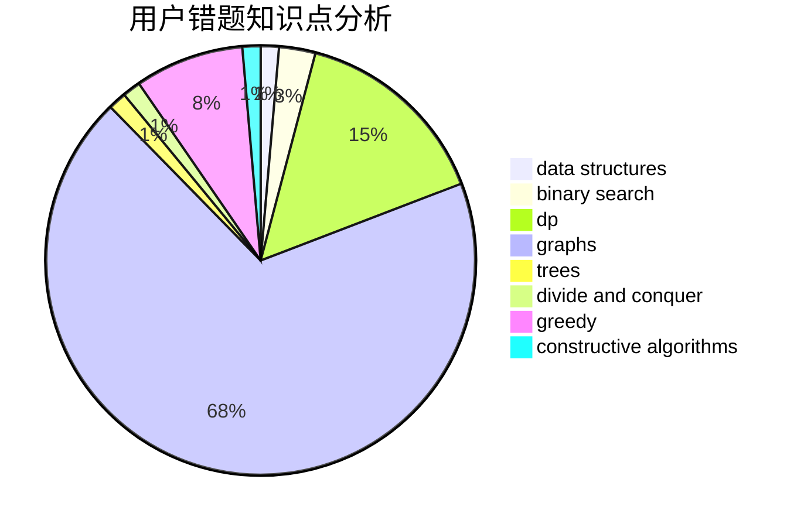

# Tom_Liu

<!-- tabs:start -->

#### **用户提交结果分析**

#### **用户做题类型偏好分析**

#### **用户错题知识点分析**

<!-- tabs:end -->
# 推荐题目
[1388B](https://codeforces.com/contest/1388/problem/B)		greedy,
                        math		  
[1425B](https://codeforces.com/contest/1425/problem/B)		divide and conquer,
                        dp		  
[1C](https://codeforces.com/contest/1/problem/C)		geometry,
                        math		  
[1310D](https://codeforces.com/contest/1310/problem/D)		dp,
                        graphs,
                        probabilities		  
[777D](https://codeforces.com/contest/777/problem/D)		binary search,
                        greedy,
                        implementation,
                        strings		  
[696B](https://codeforces.com/contest/696/problem/B)		dfs and similar,
                        math,
                        probabilities,
                        trees		  
[571C](https://codeforces.com/contest/571/problem/C)		constructive algorithms,
                        dfs and similar,
                        graphs,
                        greedy		  
[421B](https://codeforces.com/contest/421/problem/B)		dsu,graphs,sortings,trees		  
[600E](https://codeforces.com/contest/600/problem/E)		data structures,
                        dfs and similar,
                        dsu,
                        trees		  
[1267F](https://codeforces.com/contest/1267/problem/F)		graphs		  
