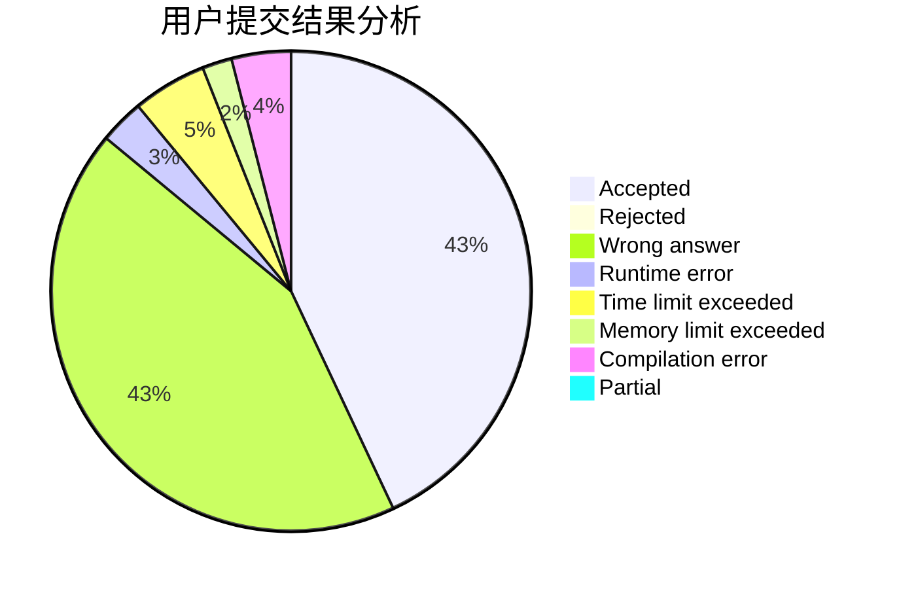
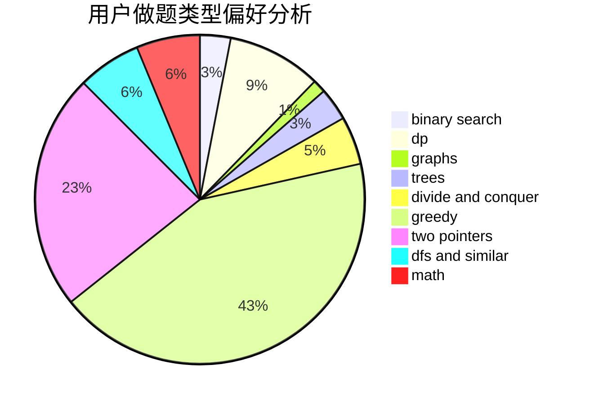

# Aestas16

<!-- tabs:start -->

#### **用户提交结果分析**

#### **用户做题类型偏好分析**

<!-- tabs:end -->
# 推荐题目
[19A](https://codeforces.com/contest/19/problem/A)
[1082F](https://codeforces.com/contest/1082/problem/F)
[1030A](https://codeforces.com/contest/1030/problem/A)
[13932](https://codeforces.com/contest/1393/problem/2)
[200B](https://codeforces.com/contest/200/problem/B)
[1250H](https://codeforces.com/contest/1250/problem/H)
[1330D](https://codeforces.com/contest/1330/problem/D)
[1366G](https://codeforces.com/contest/1366/problem/G)
[199E](https://codeforces.com/contest/199/problem/E)
[200C](https://codeforces.com/contest/200/problem/C)
