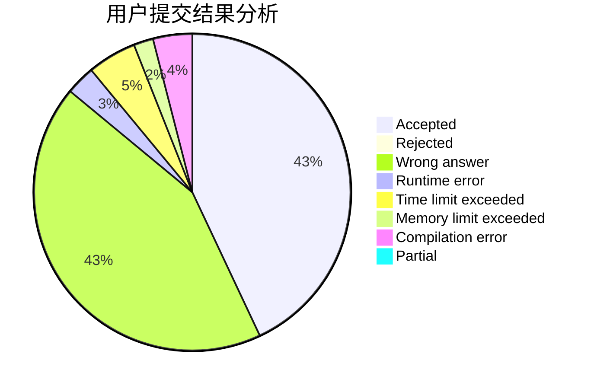
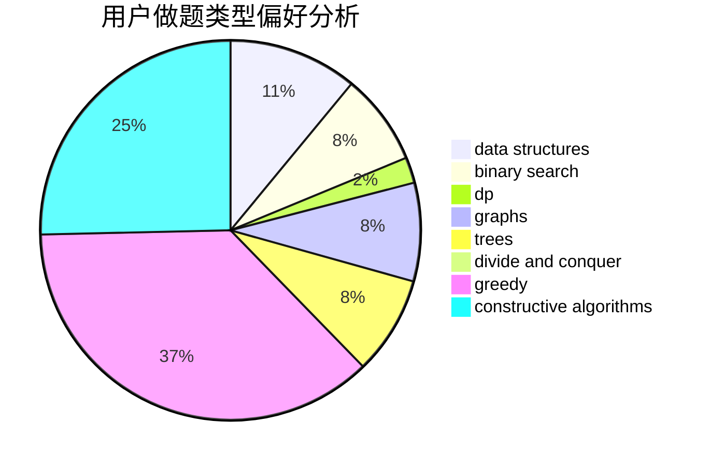
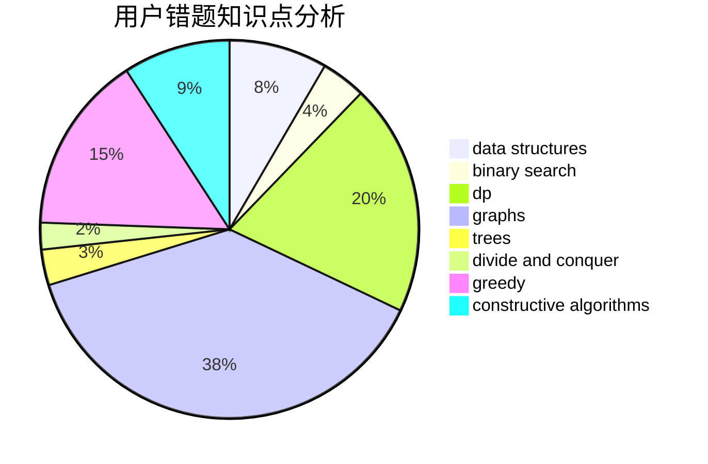

# Aestas16

<!-- tabs:start -->

#### **用户提交结果分析**

#### **用户做题类型偏好分析**

#### **用户错题知识点分析**

<!-- tabs:end -->
# 推荐题目
[171H](https://codeforces.com/contest/171/problem/H)		*special problem,
                        implementation		  
[1082C](https://codeforces.com/contest/1082/problem/C)		greedy,
                        sortings		  
[1029F](https://codeforces.com/contest/1029/problem/F)		binary search,
                        brute force,
                        math,
                        number theory		  
[1383C](https://codeforces.com/contest/1383/problem/C)		bitmasks,
                        dp,
                        graphs,
                        trees		  
[175B](https://codeforces.com/contest/175/problem/B)		implementation		  
[1245F](https://codeforces.com/contest/1245/problem/F)		bitmasks,
                        brute force,
                        combinatorics,
                        dp		  
[1324B](https://codeforces.com/contest/1324/problem/B)		brute force,
                        strings		  
[1358E](https://codeforces.com/contest/1358/problem/E)		constructive algorithms,
                        data structures,
                        greedy,
                        implementation		  
[171G](https://codeforces.com/contest/171/problem/G)		*special problem		  
[176B](https://codeforces.com/contest/176/problem/B)		dp		  
