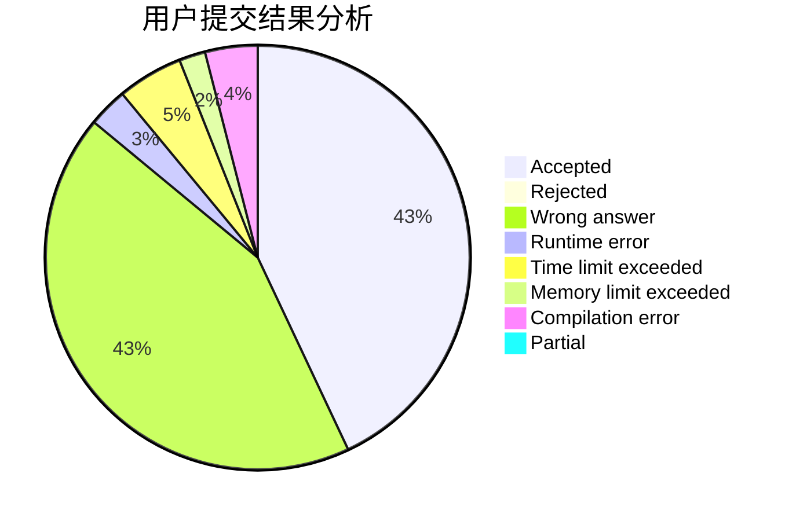
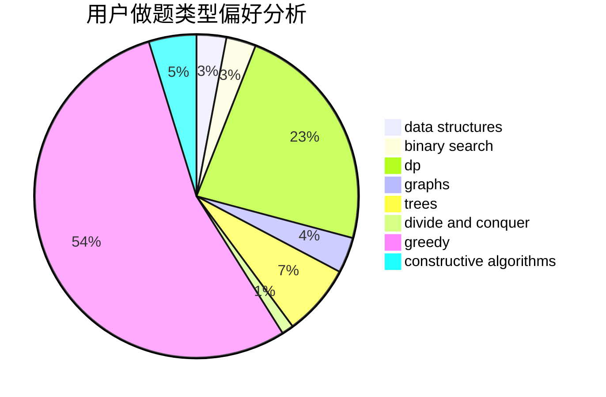
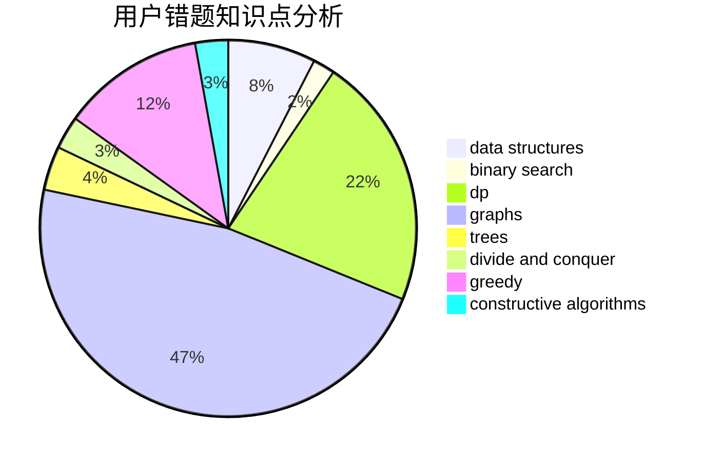

# Aestas16

<!-- tabs:start -->

#### **用户提交结果分析**

#### **用户做题类型偏好分析**

#### **用户错题知识点分析**

<!-- tabs:end -->
# 推荐题目
[19A](https://codeforces.com/contest/19/problem/A)		implementation		  
[1082F](https://codeforces.com/contest/1082/problem/F)		dp,
                        strings,
                        trees		  
[1030A](https://codeforces.com/contest/1030/problem/A)		implementation		  
[13932](https://codeforces.com/contest/1393/problem/2)		dsu,graphs,sortings,trees		  
[200B](https://codeforces.com/contest/200/problem/B)		implementation,
                        math		  
[1250H](https://codeforces.com/contest/1250/problem/H)		math		  
[1330D](https://codeforces.com/contest/1330/problem/D)		dsu,graphs,sortings,trees		  
[1366G](https://codeforces.com/contest/1366/problem/G)		data structures,
                        dp,
                        strings		  
[199E](https://codeforces.com/contest/199/problem/E)		dsu,graphs,sortings,trees		  
[200C](https://codeforces.com/contest/200/problem/C)		brute force,
                        implementation		  
