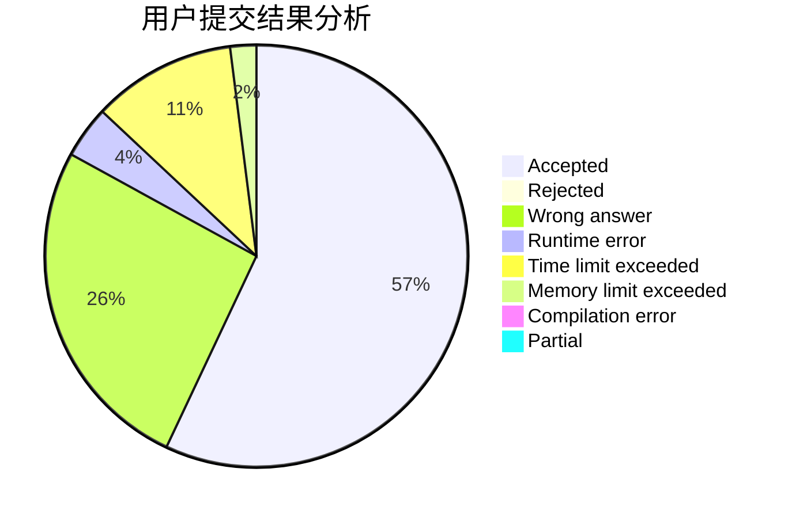
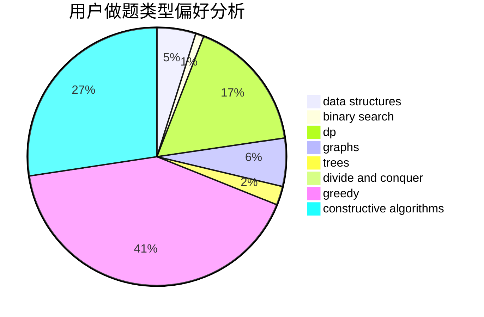
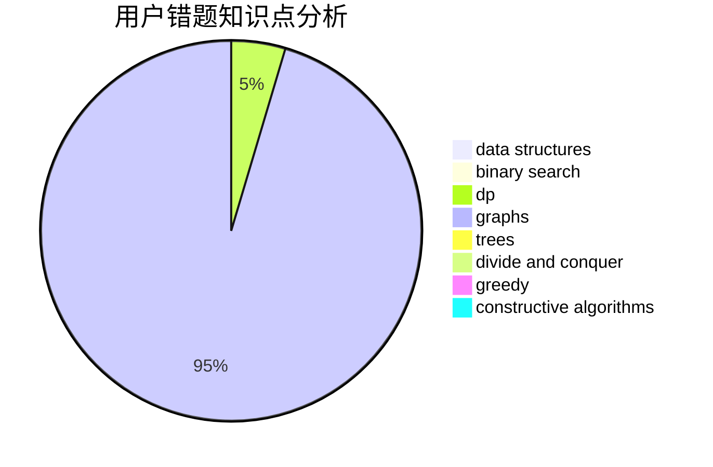

# Tomarange
<!-- tabs:start -->
#### **用户提交结果分析**

#### **用户做题类型偏好分析**

#### **用户错题知识点分析**

<!-- tabs:end -->
# 推荐题目
[Bouncing Ball](http://codeforces.com/problemset/problem/1415/C)		brute force,
                        dp,
                        implementation		  
[Fox And Dinner](https://codeforces.com/contest/512/problem/C)		flows		  
[Circle Radius (2 points)](https://codeforces.com/contest/1164/problem/H)		nan		  
[Two Melodies](http://codeforces.com/problemset/problem/813/D)		dp,
                        flows		  
[Counting-out Rhyme](http://codeforces.com/problemset/problem/792/B)		implementation		  
[Superhero's Job](http://codeforces.com/problemset/problem/542/D)		dfs and similar,
                        dp,
                        hashing,
                        math,
                        number theory		  
[Intergalactic Sliding Puzzle](http://codeforces.com/problemset/problem/1280/F)		combinatorics,
                        constructive algorithms,
                        math		  
[Rectangular Polyline](http://codeforces.com/problemset/problem/1444/D)		constructive algorithms,
                        dp,
                        geometry		  
[2 + 2 != 4](http://codeforces.com/problemset/problem/952/F)		nan		  
[MYSTERIOUS LANGUAGE](http://codeforces.com/problemset/problem/171/E)		*special problem		  
<!-- tabs:start -->
#### **data structures**
[Bouncing Ball](http://codeforces.com/problemset/problem/396/C)		data structures,
                        graphs,
                        trees		  
[Fox And Dinner](http://codeforces.com/problemset/problem/1019/E)		data structures,
                        divide and conquer,
                        trees		  
[Circle Radius (2 points)](https://codeforces.com/contest/1269/problem/E)		binary search,
                        data structures		  
[Two Melodies](https://codeforces.com/contest/1314/problem/E)		binary search,
                        data structures,
                        dp,
                        greedy		  
[Counting-out Rhyme](http://codeforces.com/problemset/problem/626/G)		data structures,
                        dp,
                        greedy,
                        math		  
[Superhero's Job](http://codeforces.com/problemset/problem/232/D)		binary search,
                        data structures,
                        string suffix structures		  
[Intergalactic Sliding Puzzle](http://codeforces.com/problemset/problem/375/D)		data structures,
                        dfs and similar,
                        trees		  
[Rectangular Polyline](http://codeforces.com/problemset/problem/1492/C)		binary search,
                        data structures,
                        dp,
                        greedy,
                        two pointers		  
[2 + 2 != 4](http://codeforces.com/problemset/problem/1490/G)		binary search,
                        data structures,
                        math		  
[MYSTERIOUS LANGUAGE](http://codeforces.com/problemset/problem/1479/D)		binary search,
                        bitmasks,
                        brute force,
                        data structures,
                        probabilities,
                        trees		  
#### **binary search**
[Bouncing Ball](http://codeforces.com/problemset/problem/1175/C)		binary search,
                        brute force,
                        greedy		  
[Fox And Dinner](https://codeforces.com/contest/1269/problem/E)		binary search,
                        data structures		  
[Circle Radius (2 points)](https://codeforces.com/contest/1314/problem/E)		binary search,
                        data structures,
                        dp,
                        greedy		  
[Two Melodies](http://codeforces.com/problemset/problem/232/D)		binary search,
                        data structures,
                        string suffix structures		  
[Counting-out Rhyme](http://codeforces.com/problemset/problem/1399/E2)		binary search,
                        dfs and similar,
                        greedy,
                        sortings,
                        trees,
                        two pointers		  
[Superhero's Job](https://codeforces.com/contest/1434/problem/A)		binary search,
                        brute force,
                        dp,
                        implementation,
                        sortings,
                        two pointers		  
[Intergalactic Sliding Puzzle](http://codeforces.com/problemset/problem/1436/C)		binary search,
                        combinatorics		  
[Rectangular Polyline](http://codeforces.com/problemset/problem/1492/C)		binary search,
                        data structures,
                        dp,
                        greedy,
                        two pointers		  
[2 + 2 != 4](http://codeforces.com/problemset/problem/1463/D)		binary search,
                        constructive algorithms,
                        greedy,
                        two pointers		  
[MYSTERIOUS LANGUAGE](http://codeforces.com/problemset/problem/1490/G)		binary search,
                        data structures,
                        math		  
#### **dp**
[Bouncing Ball](http://codeforces.com/problemset/problem/1415/C)		brute force,
                        dp,
                        implementation		  
[Fox And Dinner](http://codeforces.com/problemset/problem/813/D)		dp,
                        flows		  
[Circle Radius (2 points)](http://codeforces.com/problemset/problem/542/D)		dfs and similar,
                        dp,
                        hashing,
                        math,
                        number theory		  
[Two Melodies](http://codeforces.com/problemset/problem/1444/D)		constructive algorithms,
                        dp,
                        geometry		  
[Counting-out Rhyme](http://codeforces.com/problemset/problem/429/B)		dp		  
[Superhero's Job](http://codeforces.com/problemset/problem/277/D)		dp,
                        probabilities		  
[Intergalactic Sliding Puzzle](http://codeforces.com/problemset/problem/596/D)		dp,
                        math,
                        probabilities,
                        sortings		  
[Rectangular Polyline](http://codeforces.com/problemset/problem/468/E)		dp,
                        graph matchings,
                        math,
                        meet-in-the-middle		  
[2 + 2 != 4](http://codeforces.com/problemset/problem/1238/F)		dfs and similar,
                        dp,
                        graphs,
                        trees		  
[MYSTERIOUS LANGUAGE](http://codeforces.com/problemset/problem/274/B)		dfs and similar,
                        dp,
                        greedy,
                        trees		  
#### **graph**
[Bouncing Ball](http://codeforces.com/problemset/problem/396/C)		data structures,
                        graphs,
                        trees		  
[Fox And Dinner](http://codeforces.com/problemset/problem/468/E)		dp,
                        graph matchings,
                        math,
                        meet-in-the-middle		  
[Circle Radius (2 points)](http://codeforces.com/problemset/problem/1238/F)		dfs and similar,
                        dp,
                        graphs,
                        trees		  
[Two Melodies](http://codeforces.com/problemset/problem/894/E)		dp,
                        graphs		  
[Counting-out Rhyme](http://codeforces.com/problemset/problem/1487/C)		brute force,
                        constructive algorithms,
                        dfs and similar,
                        graphs,
                        greedy,
                        implementation,
                        math		  
[Superhero's Job](http://codeforces.com/problemset/problem/1437/C)		dp,
                        flows,
                        graph matchings,
                        greedy,
                        math,
                        sortings		  
[Intergalactic Sliding Puzzle](http://codeforces.com/problemset/problem/1470/D)		constructive algorithms,
                        dfs and similar,
                        graph matchings,
                        graphs,
                        greedy		  
[Rectangular Polyline](http://codeforces.com/problemset/problem/1476/C)		dp,
                        graphs,
                        greedy		  
[2 + 2 != 4](http://codeforces.com/problemset/problem/1304/D)		constructive algorithms,
                        graphs,
                        greedy,
                        two pointers		  
[MYSTERIOUS LANGUAGE](http://codeforces.com/problemset/problem/1475/C)		combinatorics,
                        graphs,
                        math		  
#### **trees**
[Bouncing Ball](http://codeforces.com/problemset/problem/396/C)		data structures,
                        graphs,
                        trees		  
[Fox And Dinner](http://codeforces.com/problemset/problem/1238/F)		dfs and similar,
                        dp,
                        graphs,
                        trees		  
[Circle Radius (2 points)](http://codeforces.com/problemset/problem/1019/E)		data structures,
                        divide and conquer,
                        trees		  
[Two Melodies](http://codeforces.com/problemset/problem/274/B)		dfs and similar,
                        dp,
                        greedy,
                        trees		  
[Counting-out Rhyme](http://codeforces.com/problemset/problem/1399/E2)		binary search,
                        dfs and similar,
                        greedy,
                        sortings,
                        trees,
                        two pointers		  
[Superhero's Job](http://codeforces.com/problemset/problem/375/D)		data structures,
                        dfs and similar,
                        trees		  
[Intergalactic Sliding Puzzle](http://codeforces.com/problemset/problem/1479/D)		binary search,
                        bitmasks,
                        brute force,
                        data structures,
                        probabilities,
                        trees		  
[Rectangular Polyline](http://codeforces.com/problemset/problem/1511/C)		brute force,
                        data structures,
                        implementation,
                        trees		  
[2 + 2 != 4](http://codeforces.com/problemset/problem/1499/F)		combinatorics,
                        dfs and similar,
                        dp,
                        trees		  
[MYSTERIOUS LANGUAGE](http://codeforces.com/problemset/problem/1491/E)		brute force,
                        dfs and similar,
                        divide and conquer,
                        number theory,
                        trees		  
#### **divide and conquer**
[Bouncing Ball](http://codeforces.com/problemset/problem/1019/E)		data structures,
                        divide and conquer,
                        trees		  
[Fox And Dinner](http://codeforces.com/problemset/problem/1461/D)		binary search,
                        brute force,
                        data structures,
                        divide and conquer,
                        implementation,
                        sortings		  
[Circle Radius (2 points)](http://codeforces.com/problemset/problem/1466/G)		combinatorics,
                        divide and conquer,
                        hashing,
                        math,
                        string suffix structures,
                        strings		  
[Two Melodies](http://codeforces.com/problemset/problem/1490/D)		dfs and similar,
                        divide and conquer,
                        implementation		  
[Counting-out Rhyme](https://codeforces.com/contest/1483/problem/C)		data structures,
                        divide and conquer,
                        dp		  
[Superhero's Job](http://codeforces.com/problemset/problem/1491/E)		brute force,
                        dfs and similar,
                        divide and conquer,
                        number theory,
                        trees		  
[Intergalactic Sliding Puzzle](http://codeforces.com/problemset/problem/1303/G)		data structures,
                        divide and conquer,
                        geometry,
                        trees		  
[Rectangular Polyline](http://codeforces.com/problemset/problem/1494/D)		constructive algorithms,
                        data structures,
                        dfs and similar,
                        divide and conquer,
                        dsu,
                        greedy,
                        sortings,
                        trees		  
[2 + 2 != 4](http://codeforces.com/problemset/problem/1482/E)		data structures,
                        divide and conquer,
                        dp		  
[MYSTERIOUS LANGUAGE](http://codeforces.com/problemset/problem/566/C)		dfs and similar,
                        divide and conquer,
                        trees		  
#### **greedy**
[Bouncing Ball](http://codeforces.com/problemset/problem/1175/C)		binary search,
                        brute force,
                        greedy		  
[Fox And Dinner](http://codeforces.com/problemset/problem/405/D)		greedy,
                        implementation,
                        math		  
[Circle Radius (2 points)](http://codeforces.com/problemset/problem/274/B)		dfs and similar,
                        dp,
                        greedy,
                        trees		  
[Two Melodies](https://codeforces.com/contest/1314/problem/E)		binary search,
                        data structures,
                        dp,
                        greedy		  
[Counting-out Rhyme](http://codeforces.com/problemset/problem/1321/C)		brute force,
                        constructive algorithms,
                        greedy,
                        strings		  
[Superhero's Job](http://codeforces.com/problemset/problem/626/G)		data structures,
                        dp,
                        greedy,
                        math		  
[Intergalactic Sliding Puzzle](http://codeforces.com/problemset/problem/917/A)		dp,
                        greedy,
                        implementation,
                        math		  
[Rectangular Polyline](http://codeforces.com/problemset/problem/1399/E2)		binary search,
                        dfs and similar,
                        greedy,
                        sortings,
                        trees,
                        two pointers		  
[2 + 2 != 4](http://codeforces.com/problemset/problem/1216/B)		greedy,
                        implementation,
                        sortings		  
[MYSTERIOUS LANGUAGE](http://codeforces.com/problemset/problem/1491/A)		brute force,
                        greedy,
                        implementation		  
#### **constructive algorithms**
[Bouncing Ball](http://codeforces.com/problemset/problem/1280/F)		combinatorics,
                        constructive algorithms,
                        math		  
[Fox And Dinner](http://codeforces.com/problemset/problem/1444/D)		constructive algorithms,
                        dp,
                        geometry		  
[Circle Radius (2 points)](http://codeforces.com/problemset/problem/1270/E)		constructive algorithms,
                        geometry,
                        math		  
[Two Melodies](http://codeforces.com/problemset/problem/421/A)		constructive algorithms,
                        implementation		  
[Counting-out Rhyme](https://codeforces.com/contest/1262/problem/C)		constructive algorithms		  
[Superhero's Job](http://codeforces.com/problemset/problem/1321/C)		brute force,
                        constructive algorithms,
                        greedy,
                        strings		  
[Intergalactic Sliding Puzzle](http://codeforces.com/problemset/problem/1237/C1)		constructive algorithms,
                        geometry,
                        greedy		  
[Rectangular Polyline](http://codeforces.com/problemset/problem/1454/A)		constructive algorithms,
                        probabilities		  
[2 + 2 != 4](http://codeforces.com/problemset/problem/1493/A)		constructive algorithms,
                        greedy		  
[MYSTERIOUS LANGUAGE](http://codeforces.com/problemset/problem/1463/D)		binary search,
                        constructive algorithms,
                        greedy,
                        two pointers		  
#### **sortings**
[Bouncing Ball](http://codeforces.com/problemset/problem/596/D)		dp,
                        math,
                        probabilities,
                        sortings		  
[Fox And Dinner](http://codeforces.com/problemset/problem/1399/E2)		binary search,
                        dfs and similar,
                        greedy,
                        sortings,
                        trees,
                        two pointers		  
[Circle Radius (2 points)](http://codeforces.com/problemset/problem/1216/B)		greedy,
                        implementation,
                        sortings		  
[Two Melodies](https://codeforces.com/contest/1434/problem/A)		binary search,
                        brute force,
                        dp,
                        implementation,
                        sortings,
                        two pointers		  
[Counting-out Rhyme](http://codeforces.com/problemset/problem/1025/A)		implementation,
                        sortings		  
[Superhero's Job](https://codeforces.com/contest/1496/problem/C)		geometry,
                        greedy,
                        math,
                        sortings		  
[Intergalactic Sliding Puzzle](http://codeforces.com/problemset/problem/1495/A)		geometry,
                        greedy,
                        math,
                        sortings		  
[Rectangular Polyline](http://codeforces.com/problemset/problem/1497/A)		brute force,
                        data structures,
                        greedy,
                        sortings		  
[2 + 2 != 4](http://codeforces.com/problemset/problem/1427/A)		math,
                        sortings		  
[MYSTERIOUS LANGUAGE](http://codeforces.com/problemset/problem/1461/D)		binary search,
                        brute force,
                        data structures,
                        divide and conquer,
                        implementation,
                        sortings		  
<!-- tabs:end -->
