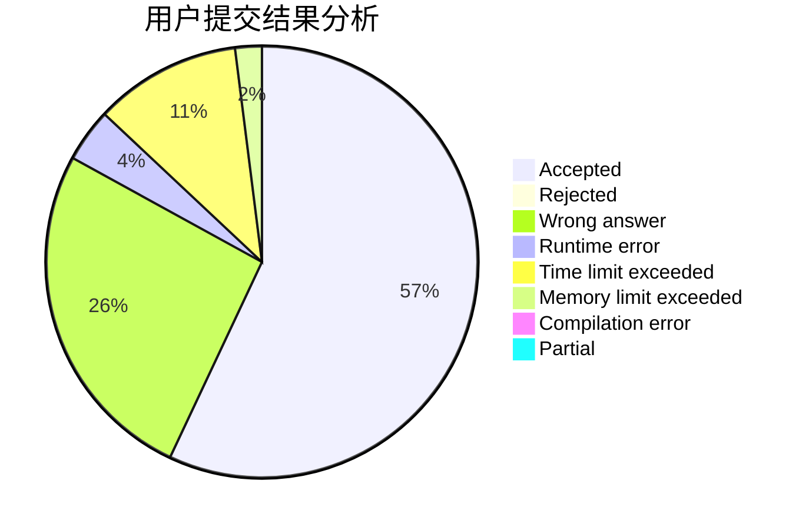
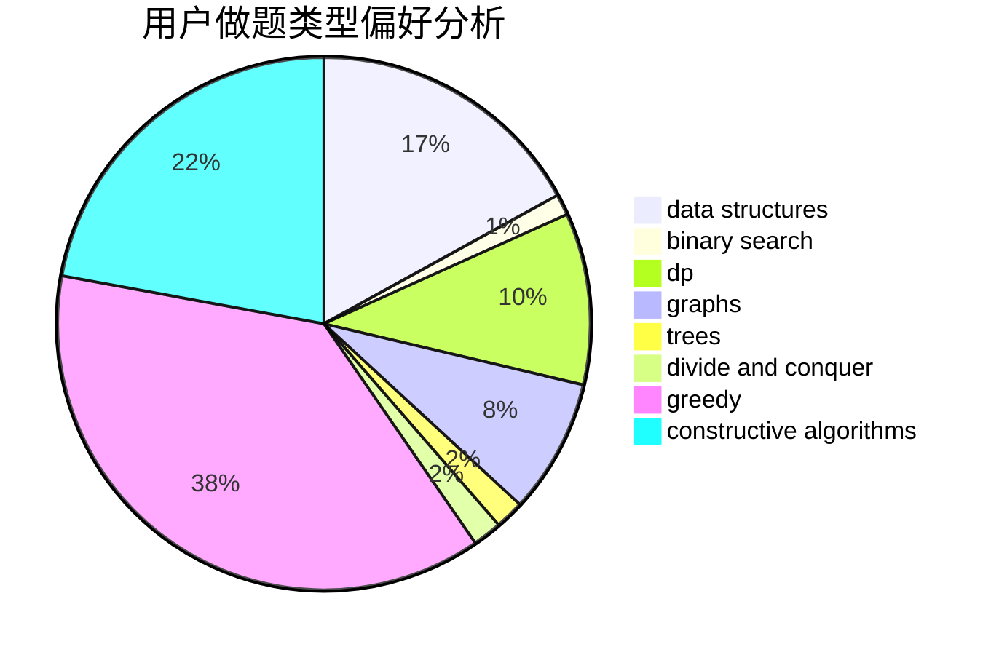
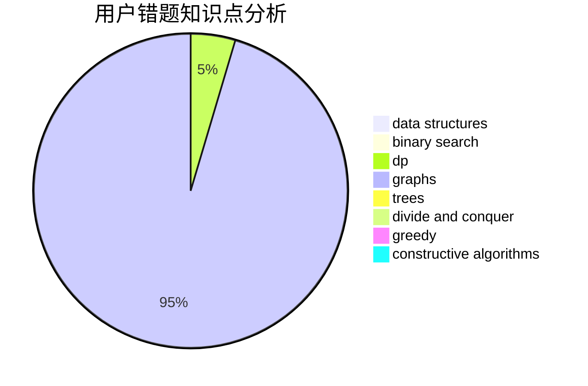

# Tomarange

<!-- tabs:start -->

#### **用户提交结果分析**

#### **用户做题类型偏好分析**

#### **用户错题知识点分析**

<!-- tabs:end -->
# 推荐题目
[1444A](https://codeforces.com/contest/1444/problem/A)		brute force,
                        math,
                        number theory		  
[831F](https://codeforces.com/contest/831/problem/F)		dsu,graphs,sortings,trees		  
[975E](https://codeforces.com/contest/975/problem/E)		geometry		  
[808A](https://codeforces.com/contest/808/problem/A)		implementation		  
[1279E](https://codeforces.com/contest/1279/problem/E)		combinatorics,
                        dp		  
[1020A](https://codeforces.com/contest/1020/problem/A)		math		  
[1178C](https://codeforces.com/contest/1178/problem/C)		combinatorics,
                        greedy,
                        math		  
[12871](https://codeforces.com/contest/1287/problem/1)		dsu,graphs,sortings,trees		  
[566G](https://codeforces.com/contest/566/problem/G)		geometry		  
[535C](https://codeforces.com/contest/535/problem/C)		binary search,
                        greedy,
                        math		  
