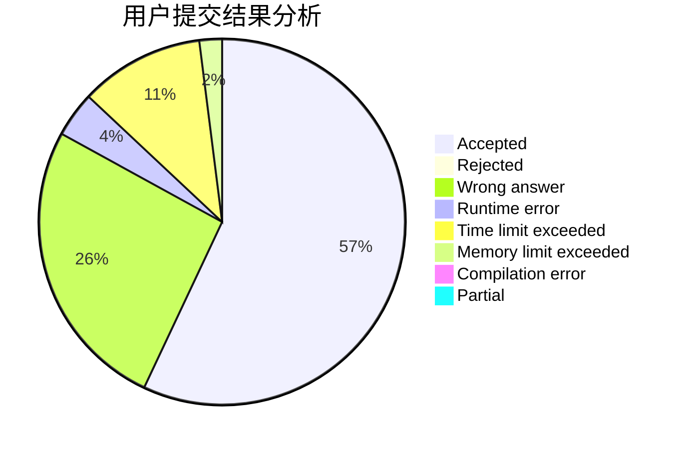
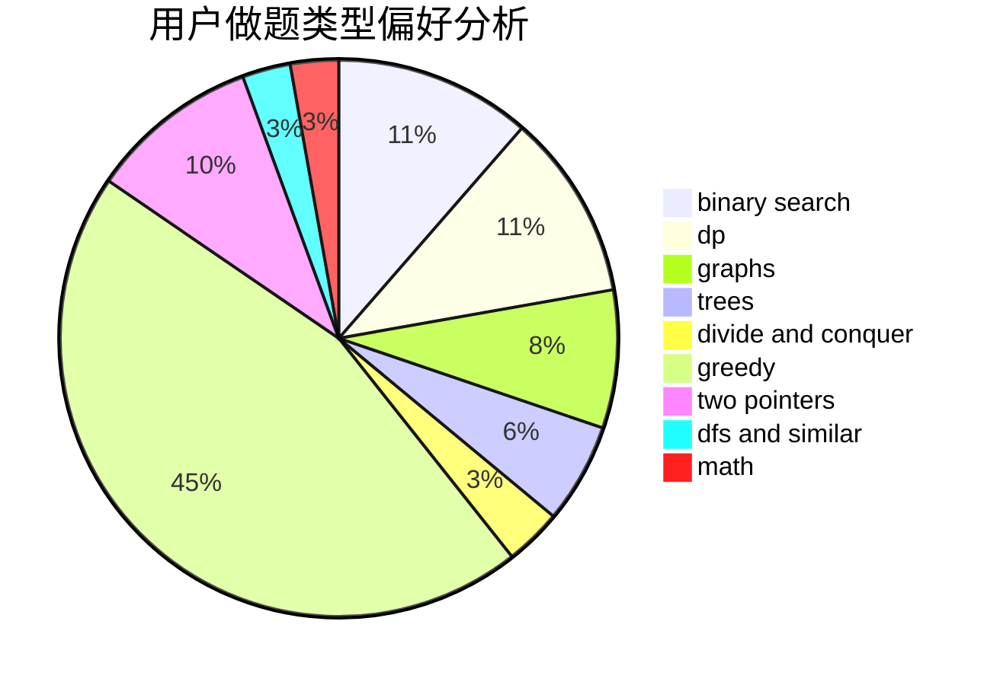

# Tomarange

<!-- tabs:start -->

#### **用户提交结果分析**

#### **用户做题类型偏好分析**

<!-- tabs:end -->
# 推荐题目
[1444A](https://codeforces.com/contest/1444/problem/A)
[831F](https://codeforces.com/contest/831/problem/F)
[975E](https://codeforces.com/contest/975/problem/E)
[808A](https://codeforces.com/contest/808/problem/A)
[1279E](https://codeforces.com/contest/1279/problem/E)
[1020A](https://codeforces.com/contest/1020/problem/A)
[1178C](https://codeforces.com/contest/1178/problem/C)
[12871](https://codeforces.com/contest/1287/problem/1)
[566G](https://codeforces.com/contest/566/problem/G)
[535C](https://codeforces.com/contest/535/problem/C)
