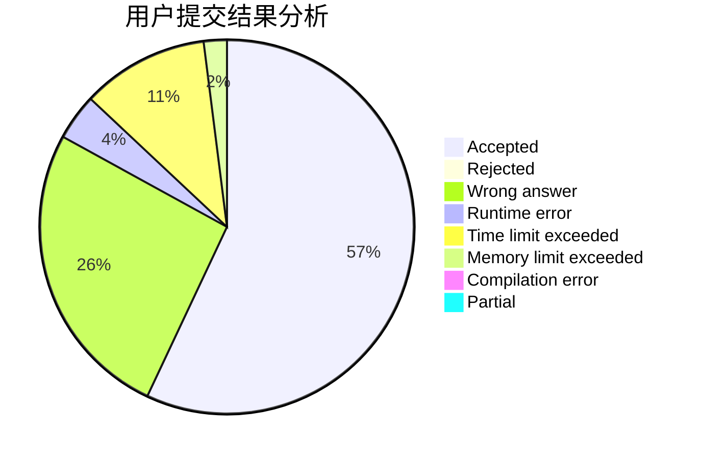
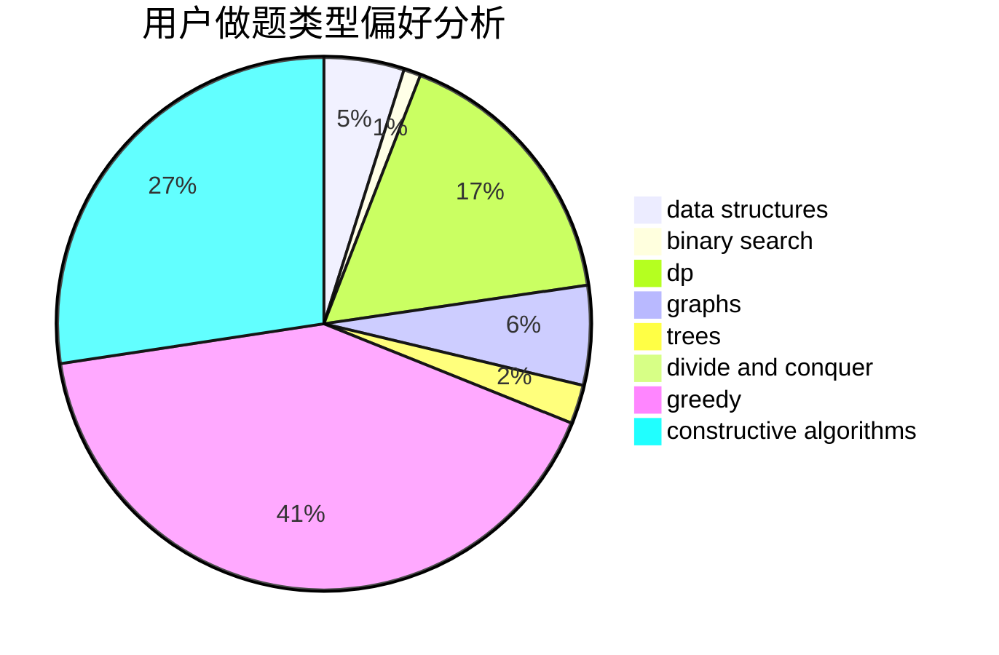
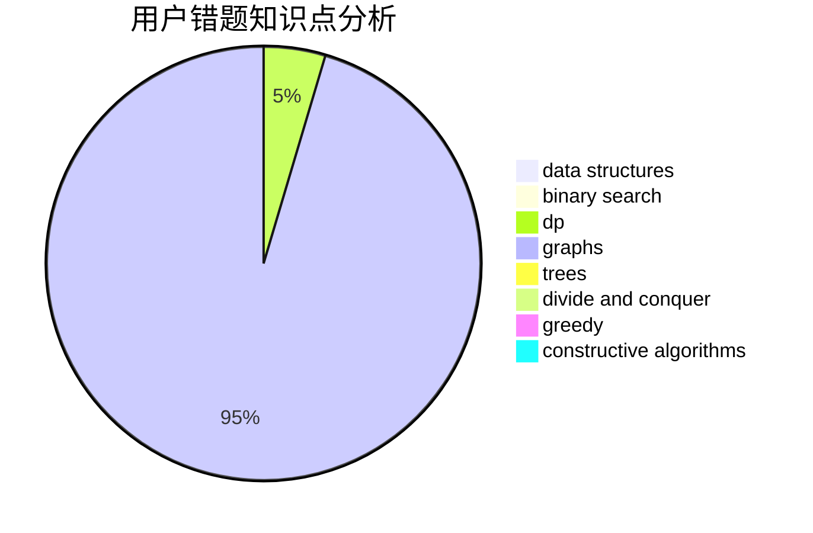

# Tomarange

<!-- tabs:start -->

#### **用户提交结果分析**

#### **用户做题类型偏好分析**

#### **用户错题知识点分析**

<!-- tabs:end -->
# 推荐题目
[1434A](https://codeforces.com/contest/1434/problem/A)		dsu,graphs,sortings,trees		  
[813D](https://codeforces.com/contest/813/problem/D)		dp,
                        flows		  
[952F](https://codeforces.com/contest/952/problem/F)		nan		  
[792B](https://codeforces.com/contest/792/problem/B)		implementation		  
[1270E](https://codeforces.com/contest/1270/problem/E)		constructive algorithms,
                        geometry,
                        math		  
[1019E](https://codeforces.com/contest/1019/problem/E)		data structures,
                        divide and conquer,
                        trees		  
[1175C](https://codeforces.com/contest/1175/problem/C)		binary search,
                        brute force,
                        greedy		  
[1280F](https://codeforces.com/contest/1280/problem/F)		combinatorics,
                        constructive algorithms,
                        math		  
[542D](https://codeforces.com/contest/542/problem/D)		dfs and similar,
                        dp,
                        hashing,
                        math,
                        number theory		  
[512C](https://codeforces.com/contest/512/problem/C)		dsu,graphs,sortings,trees		  
