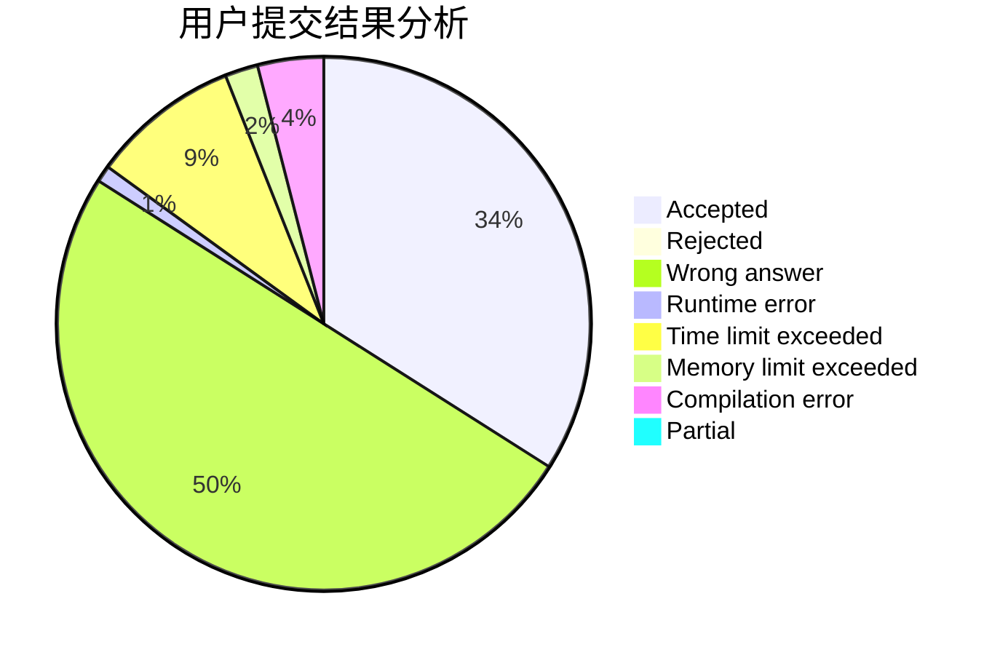
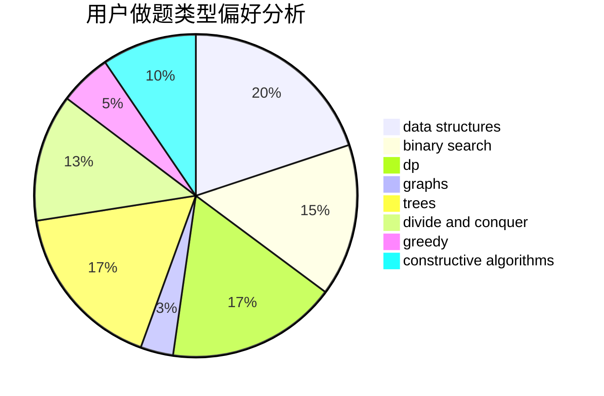
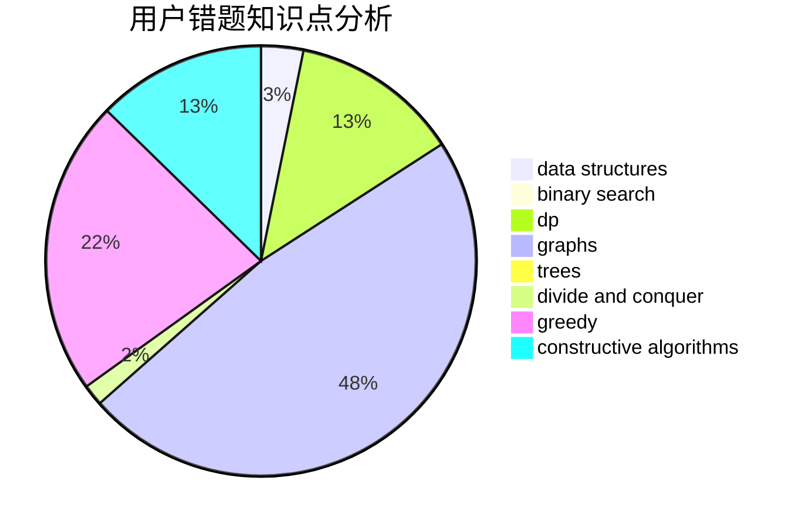

# Tommyr7

<!-- tabs:start -->

#### **用户提交结果分析**

#### **用户做题类型偏好分析**

#### **用户错题知识点分析**

<!-- tabs:end -->
# 推荐题目
[1466G](https://codeforces.com/contest/1466/problem/G)		combinatorics,
                        divide and conquer,
                        hashing,
                        math,
                        string suffix structures,
                        strings		  
[1279A](https://codeforces.com/contest/1279/problem/A)		math		  
[607B](https://codeforces.com/contest/607/problem/B)		dp		  
[1340B](https://codeforces.com/contest/1340/problem/B)		bitmasks,
                        dp,
                        graphs,
                        greedy		  
[605C](https://codeforces.com/contest/605/problem/C)		geometry		  
[735A](https://codeforces.com/contest/735/problem/A)		implementation,
                        strings		  
[987A](https://codeforces.com/contest/987/problem/A)		implementation		  
[152E](https://codeforces.com/contest/152/problem/E)		bitmasks,
                        dp,
                        graphs,
                        trees		  
[689B](https://codeforces.com/contest/689/problem/B)		dfs and similar,
                        graphs,
                        greedy,
                        shortest paths		  
[113C](https://codeforces.com/contest/113/problem/C)		brute force,
                        math,
                        number theory		  
