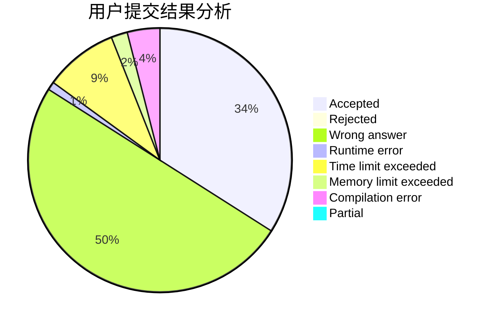
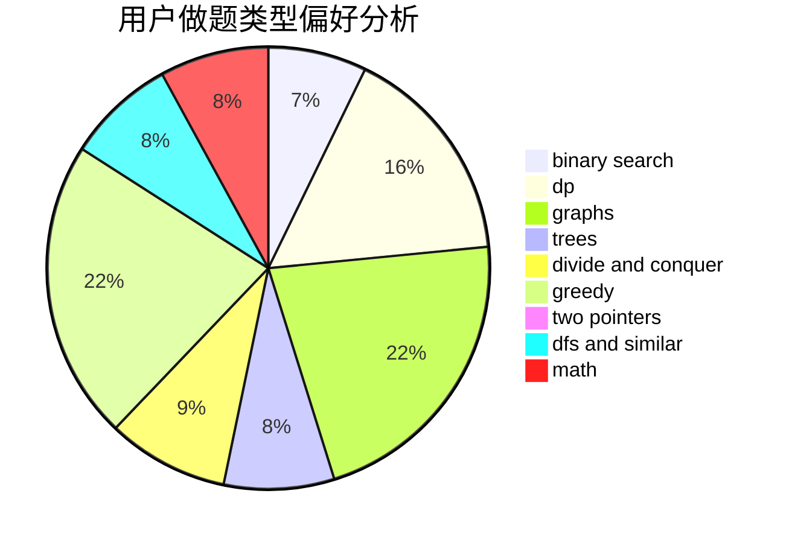

# Tommyr7

<!-- tabs:start -->

#### **用户提交结果分析**

#### **用户做题类型偏好分析**

<!-- tabs:end -->
# 推荐题目
[1466G](https://codeforces.com/contest/1466/problem/G)
[1279A](https://codeforces.com/contest/1279/problem/A)
[607B](https://codeforces.com/contest/607/problem/B)
[1340B](https://codeforces.com/contest/1340/problem/B)
[605C](https://codeforces.com/contest/605/problem/C)
[735A](https://codeforces.com/contest/735/problem/A)
[987A](https://codeforces.com/contest/987/problem/A)
[152E](https://codeforces.com/contest/152/problem/E)
[689B](https://codeforces.com/contest/689/problem/B)
[113C](https://codeforces.com/contest/113/problem/C)
