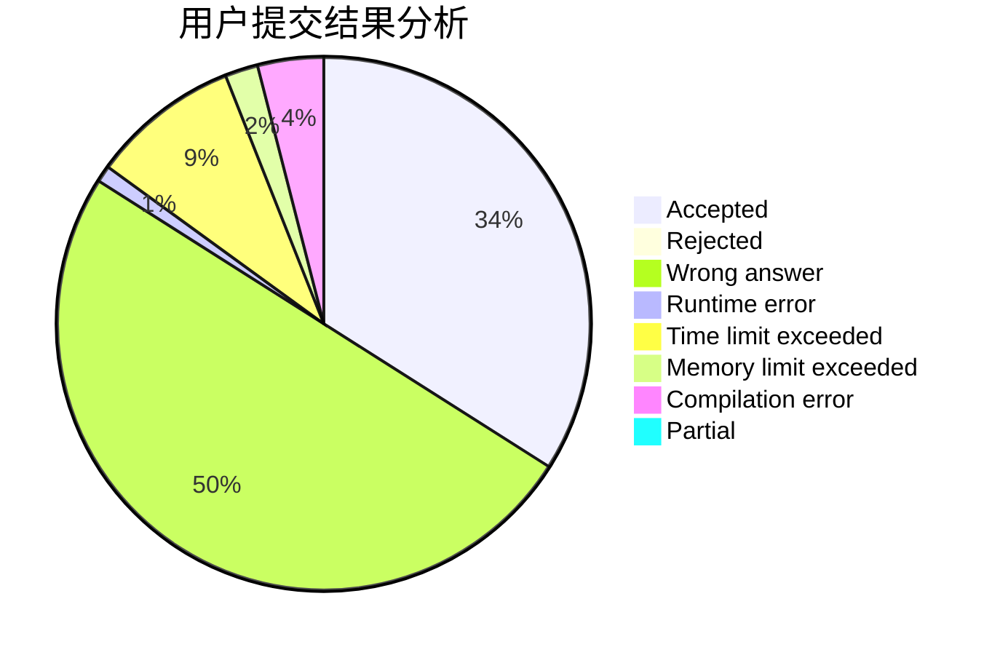
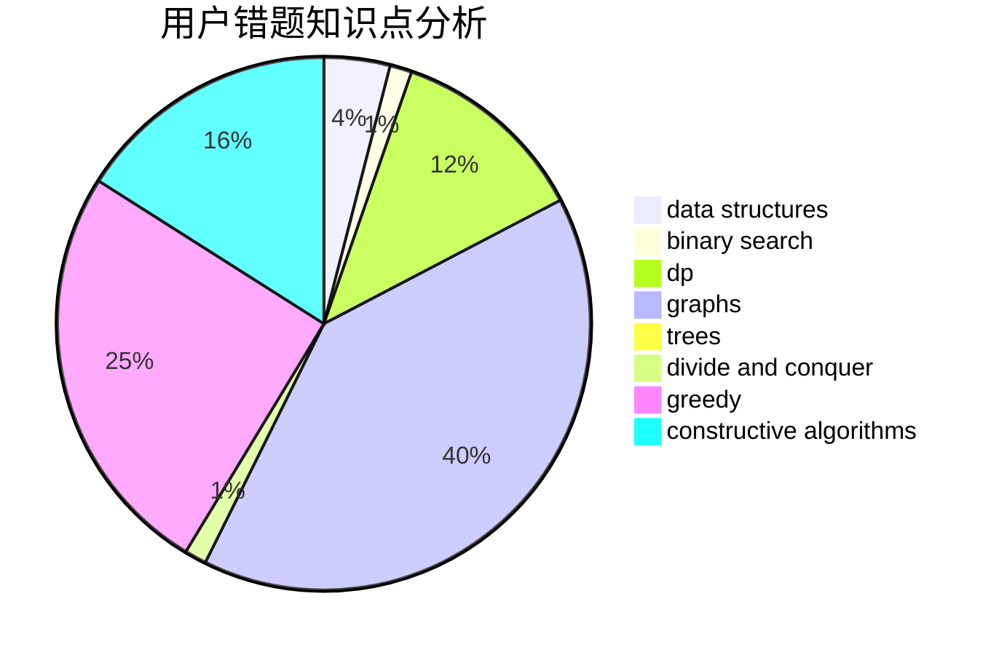

# Tommyr7

<!-- tabs:start -->

#### **用户提交结果分析**

#### **用户做题类型偏好分析**

#### **用户错题知识点分析**

<!-- tabs:end -->
# 推荐题目
[1457D](https://codeforces.com/contest/1457/problem/D)		dsu,graphs,sortings,trees		  
[1270A](https://codeforces.com/contest/1270/problem/A)		games,
                        greedy,
                        math		  
[587A](https://codeforces.com/contest/587/problem/A)		greedy		  
[1333C](https://codeforces.com/contest/1333/problem/C)		binary search,
                        data structures,
                        implementation,
                        two pointers		  
[585B](https://codeforces.com/contest/585/problem/B)		dfs and similar,
                        graphs,
                        shortest paths		  
[717E](https://codeforces.com/contest/717/problem/E)		dfs and similar		  
[965A](https://codeforces.com/contest/965/problem/A)		math		  
[1505D](https://codeforces.com/contest/1505/problem/D)		number theory		  
[667B](https://codeforces.com/contest/667/problem/B)		constructive algorithms,
                        geometry		  
[1138A](https://codeforces.com/contest/1138/problem/A)		binary search,
                        greedy,
                        implementation		  
