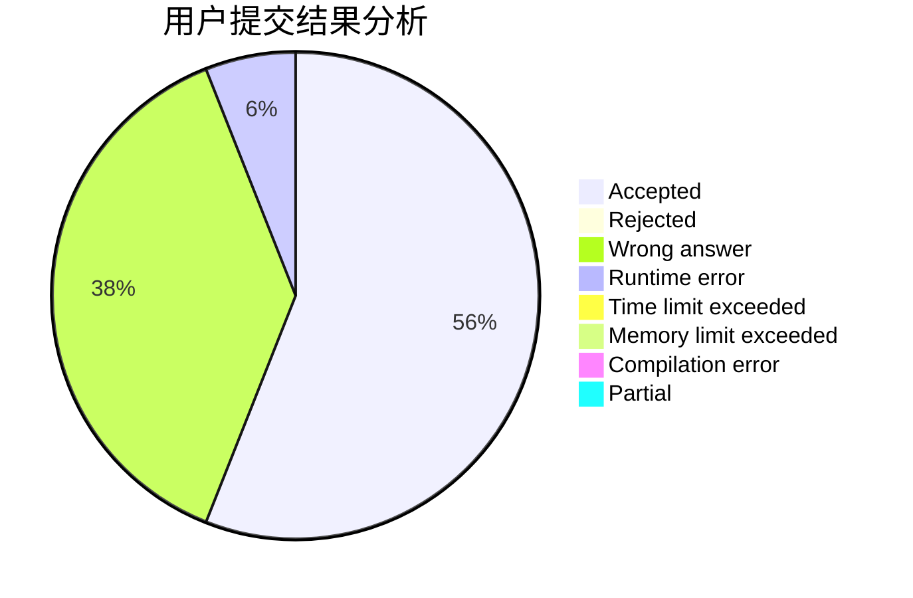
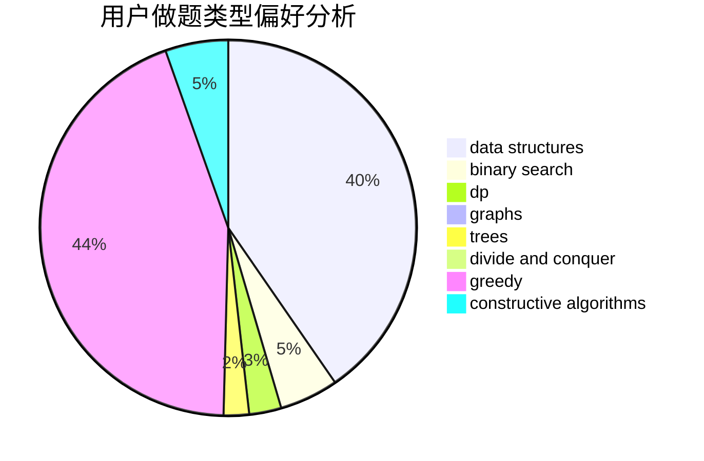
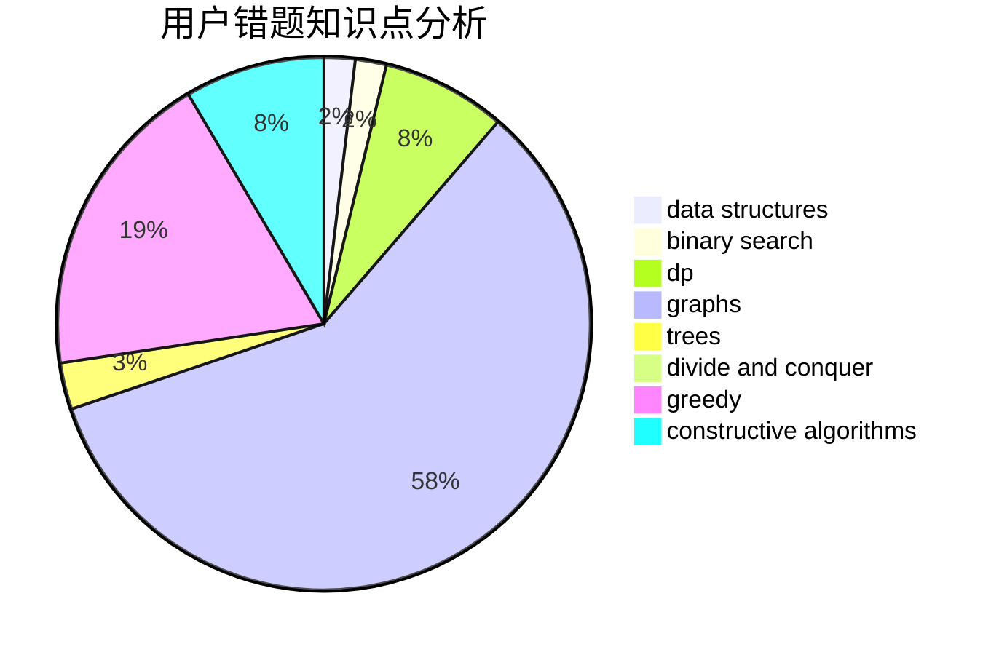

# Tomoe_Mami

<!-- tabs:start -->

#### **用户提交结果分析**

#### **用户做题类型偏好分析**

#### **用户错题知识点分析**

<!-- tabs:end -->
# 推荐题目
[894D](https://codeforces.com/contest/894/problem/D)		brute force,
                        data structures,
                        trees		  
[1340D](https://codeforces.com/contest/1340/problem/D)		constructive algorithms,
                        dfs and similar,
                        graphs,
                        trees		  
[1482H](https://codeforces.com/contest/1482/problem/H)		data structures,
                        string suffix structures,
                        trees		  
[803D](https://codeforces.com/contest/803/problem/D)		binary search,
                        greedy		  
[1459F](https://codeforces.com/contest/1459/problem/F)		dsu,graphs,sortings,trees		  
[380A](https://codeforces.com/contest/380/problem/A)		binary search,
                        brute force		  
[859E](https://codeforces.com/contest/859/problem/E)		combinatorics,
                        dfs and similar,
                        dsu,
                        graphs,
                        trees		  
[1477F](https://codeforces.com/contest/1477/problem/F)		combinatorics,
                        fft,
                        math,
                        probabilities		  
[598C](https://codeforces.com/contest/598/problem/C)		geometry,
                        sortings		  
[353A](https://codeforces.com/contest/353/problem/A)		implementation,
                        math		  
