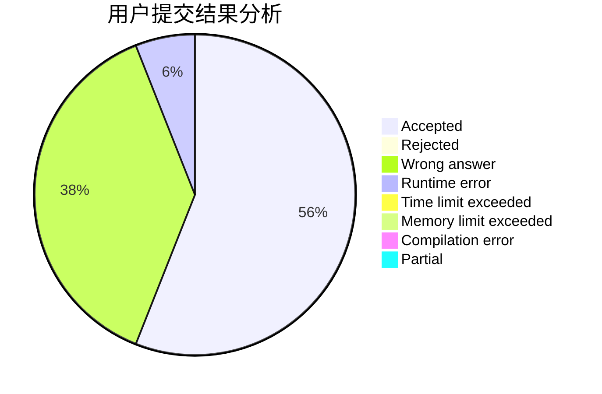
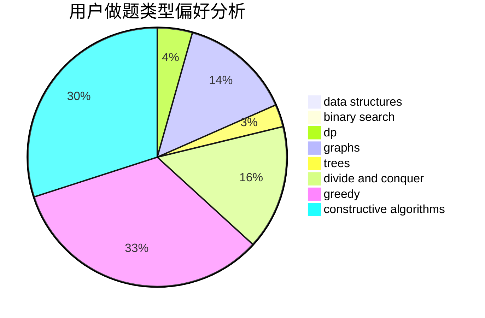
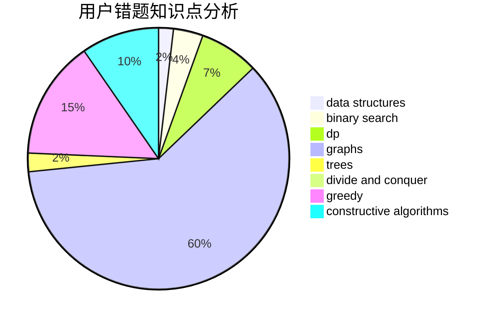

# Tomoe_Mami

<!-- tabs:start -->

#### **用户提交结果分析**

#### **用户做题类型偏好分析**

#### **用户错题知识点分析**

<!-- tabs:end -->
# 推荐题目
[873F](https://codeforces.com/contest/873/problem/F)		dsu,
                        string suffix structures,
                        strings		  
[1333E](https://codeforces.com/contest/1333/problem/E)		brute force,
                        constructive algorithms		  
[1474C](https://codeforces.com/contest/1474/problem/C)		brute force,
                        constructive algorithms,
                        data structures,
                        greedy,
                        implementation,
                        sortings		  
[787D](https://codeforces.com/contest/787/problem/D)		dsu,graphs,sortings,trees		  
[1450H2](https://codeforces.com/contest/1450H/problem/2)		combinatorics,
                        implementation,
                        math		  
[354B](https://codeforces.com/contest/354/problem/B)		bitmasks,
                        dp,
                        games		  
[840A](https://codeforces.com/contest/840/problem/A)		combinatorics,
                        greedy,
                        math,
                        number theory,
                        sortings		  
[1469E](https://codeforces.com/contest/1469/problem/E)		bitmasks,
                        brute force,
                        hashing,
                        string suffix structures,
                        strings,
                        two pointers		  
[576C](https://codeforces.com/contest/576/problem/C)		constructive algorithms,
                        divide and conquer,
                        geometry,
                        greedy,
                        sortings		  
[321D](https://codeforces.com/contest/321/problem/D)		dp,
                        greedy,
                        math		  
