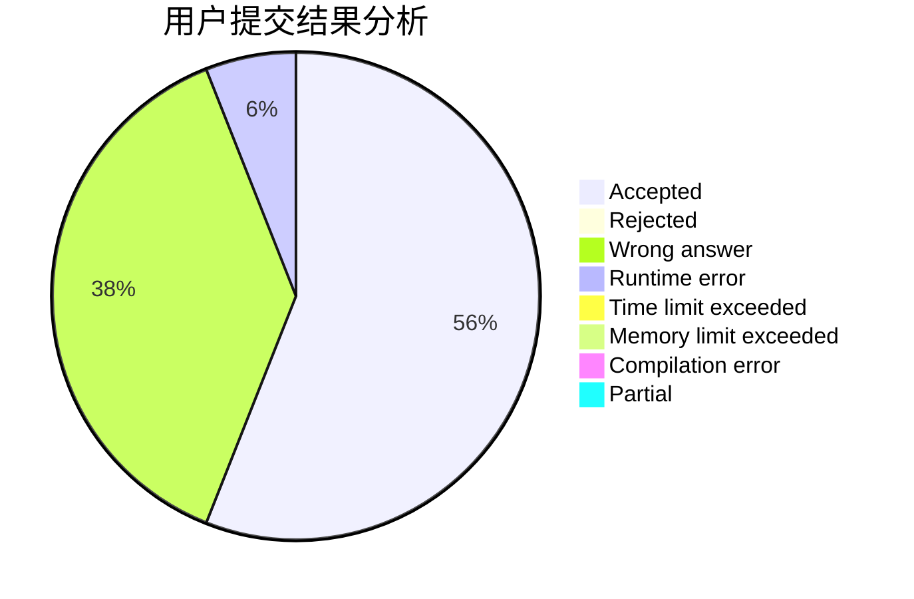
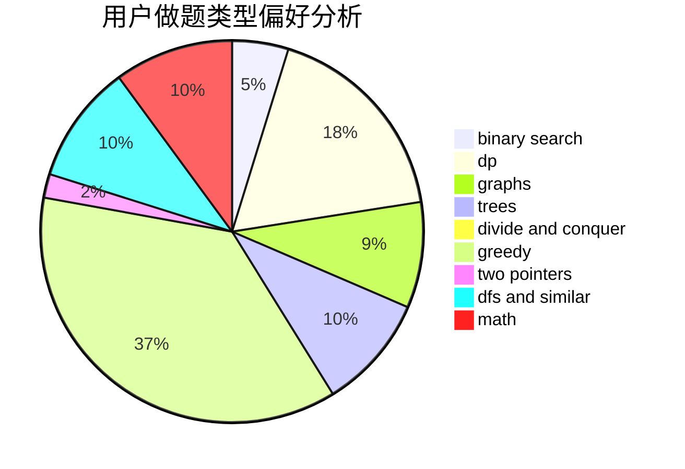

# Tomoe_Mami

<!-- tabs:start -->

#### **用户提交结果分析**

#### **用户做题类型偏好分析**

<!-- tabs:end -->
# 推荐题目
[894D](https://codeforces.com/contest/894/problem/D)
[1340D](https://codeforces.com/contest/1340/problem/D)
[1482H](https://codeforces.com/contest/1482/problem/H)
[803D](https://codeforces.com/contest/803/problem/D)
[1459F](https://codeforces.com/contest/1459/problem/F)
[380A](https://codeforces.com/contest/380/problem/A)
[859E](https://codeforces.com/contest/859/problem/E)
[1477F](https://codeforces.com/contest/1477/problem/F)
[598C](https://codeforces.com/contest/598/problem/C)
[353A](https://codeforces.com/contest/353/problem/A)
