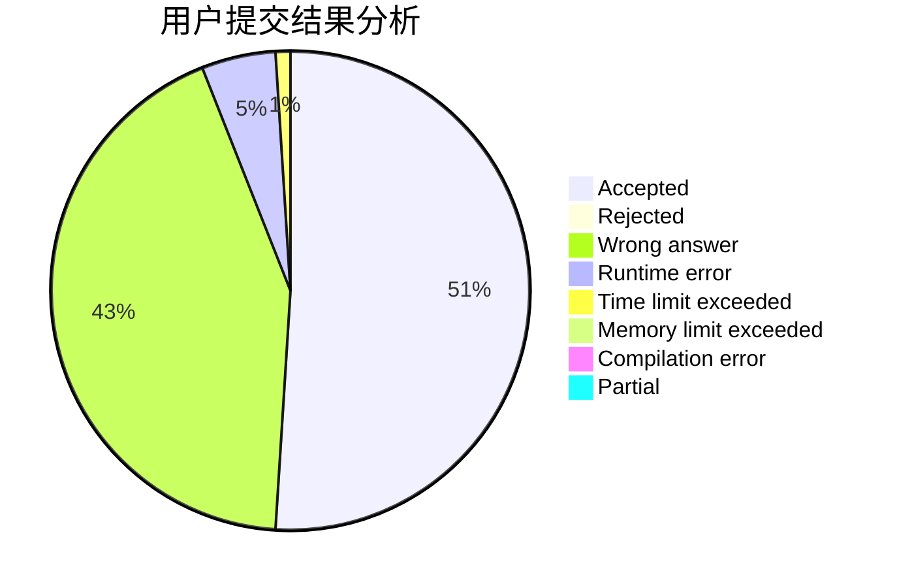
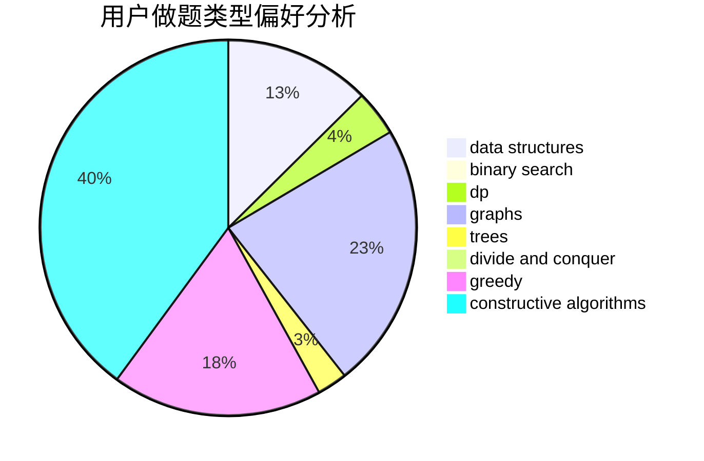
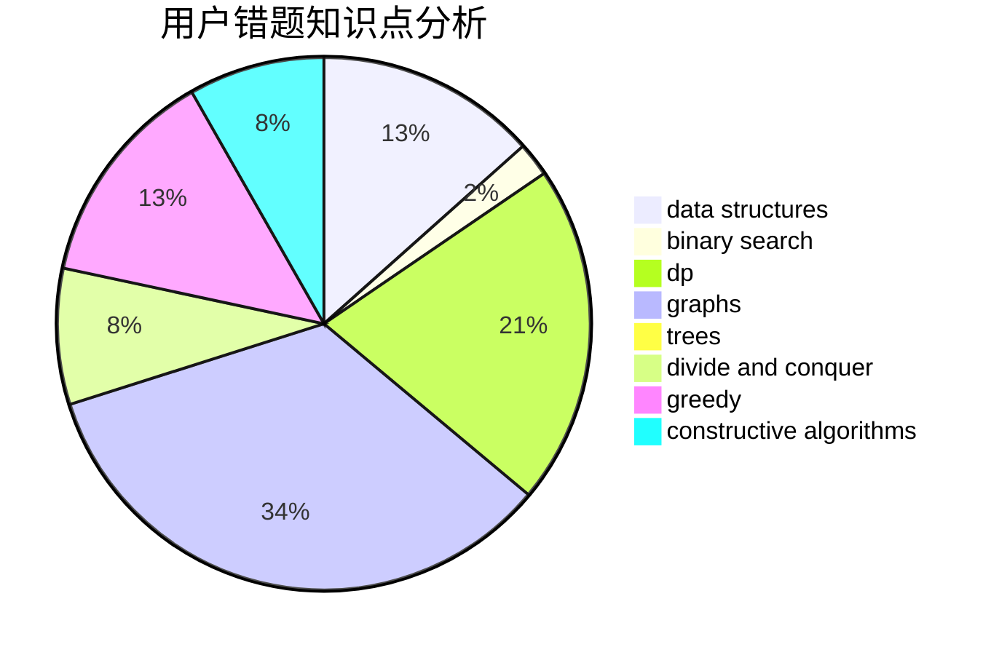

# TongChu

<!-- tabs:start -->

#### **用户提交结果分析**

#### **用户做题类型偏好分析**

#### **用户错题知识点分析**

<!-- tabs:end -->
# 推荐题目
[286A](https://codeforces.com/contest/286/problem/A)		constructive algorithms,
                        math		  
[453B](https://codeforces.com/contest/453/problem/B)		bitmasks,
                        brute force,
                        dp		  
[798C](https://codeforces.com/contest/798/problem/C)		dp,
                        greedy,
                        number theory		  
[1068C](https://codeforces.com/contest/1068/problem/C)		constructive algorithms,
                        graphs		  
[594E](https://codeforces.com/contest/594/problem/E)		string suffix structures,
                        strings		  
[573E](https://codeforces.com/contest/573/problem/E)		data structures,
                        greedy		  
[607E](https://codeforces.com/contest/607/problem/E)		binary search,
                        geometry		  
[919C](https://codeforces.com/contest/919/problem/C)		brute force,
                        implementation		  
[464E](https://codeforces.com/contest/464/problem/E)		data structures,
                        graphs,
                        shortest paths		  
[414B](https://codeforces.com/contest/414/problem/B)		combinatorics,
                        dp,
                        number theory		  
