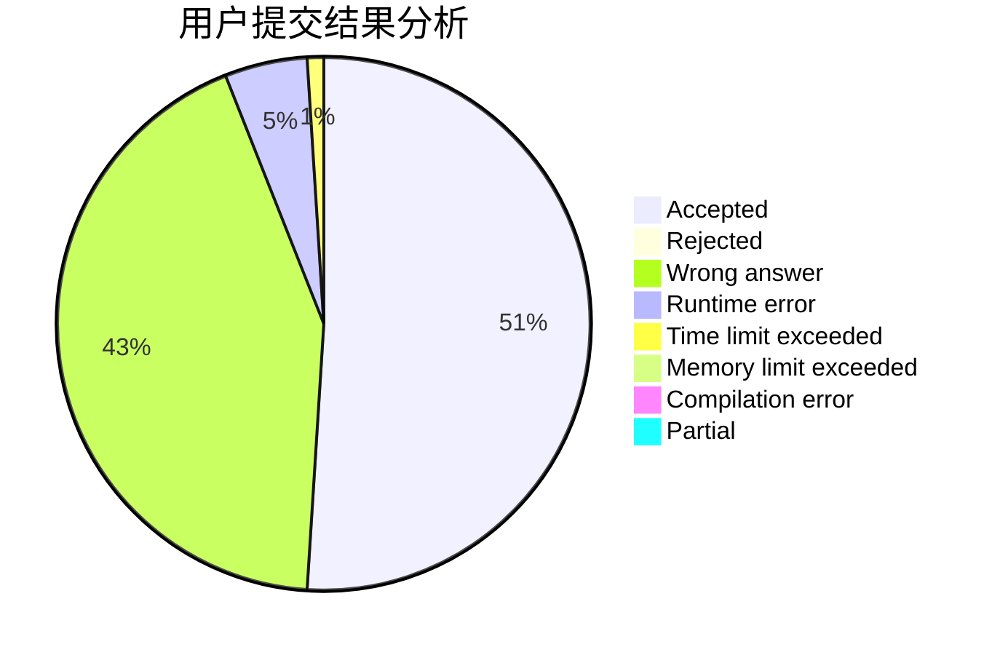
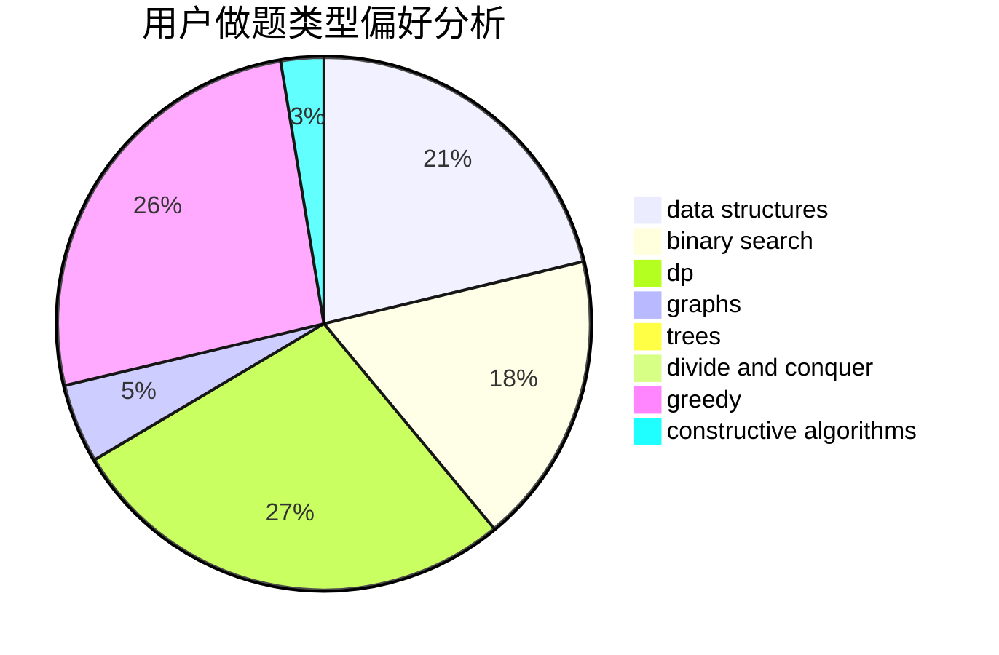
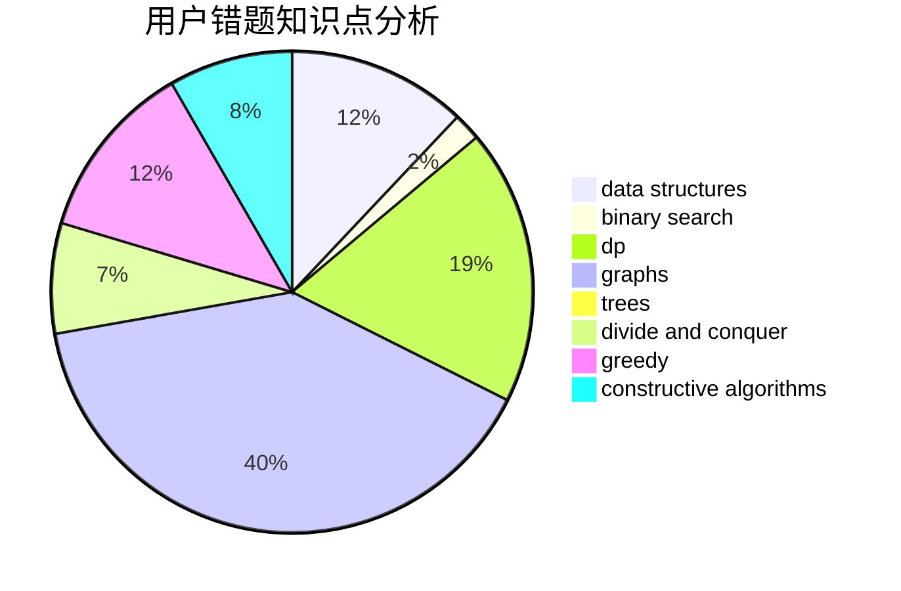

# TongChu

<!-- tabs:start -->

#### **用户提交结果分析**

#### **用户做题类型偏好分析**

#### **用户错题知识点分析**

<!-- tabs:end -->
# 推荐题目
[269E](https://codeforces.com/contest/269/problem/E)		nan		  
[431D](https://codeforces.com/contest/431/problem/D)		binary search,
                        bitmasks,
                        combinatorics,
                        dp,
                        math		  
[77E](https://codeforces.com/contest/77/problem/E)		geometry		  
[1067E](https://codeforces.com/contest/1067/problem/E)		dp,
                        graph matchings,
                        math,
                        trees		  
[574D](https://codeforces.com/contest/574/problem/D)		dsu,graphs,sortings,trees		  
[548C](https://codeforces.com/contest/548/problem/C)		dsu,graphs,sortings,trees		  
[587D](https://codeforces.com/contest/587/problem/D)		2-sat,
                        binary search		  
[903B](https://codeforces.com/contest/903/problem/B)		greedy,
                        implementation		  
[445A](https://codeforces.com/contest/445/problem/A)		dfs and similar,
                        implementation		  
[383A](https://codeforces.com/contest/383/problem/A)		data structures,
                        greedy		  
