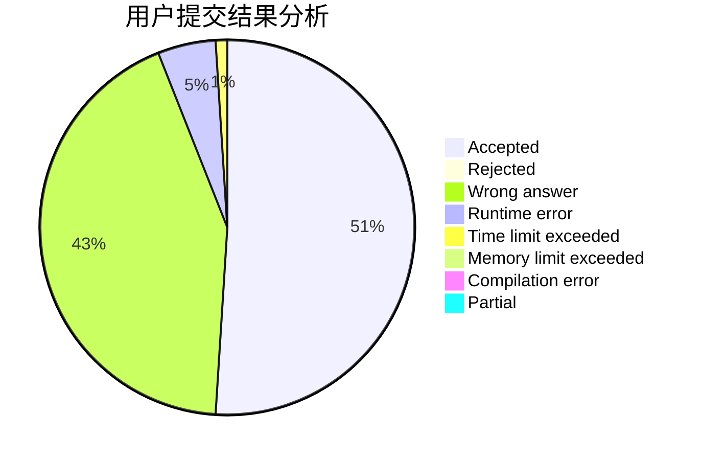
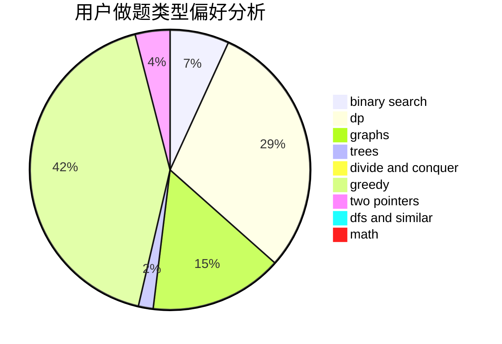

# TongChu

<!-- tabs:start -->

#### **用户提交结果分析**

#### **用户做题类型偏好分析**

<!-- tabs:end -->
# 推荐题目
[286A](https://codeforces.com/contest/286/problem/A)
[453B](https://codeforces.com/contest/453/problem/B)
[798C](https://codeforces.com/contest/798/problem/C)
[1068C](https://codeforces.com/contest/1068/problem/C)
[594E](https://codeforces.com/contest/594/problem/E)
[573E](https://codeforces.com/contest/573/problem/E)
[607E](https://codeforces.com/contest/607/problem/E)
[919C](https://codeforces.com/contest/919/problem/C)
[464E](https://codeforces.com/contest/464/problem/E)
[414B](https://codeforces.com/contest/414/problem/B)
