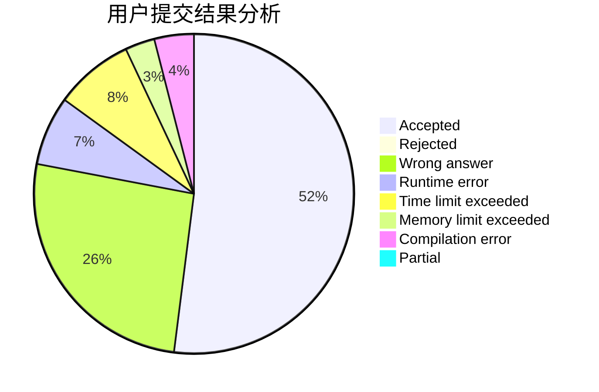
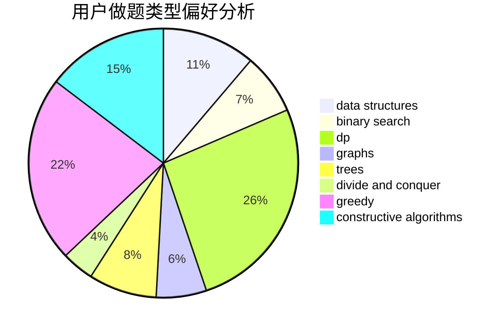
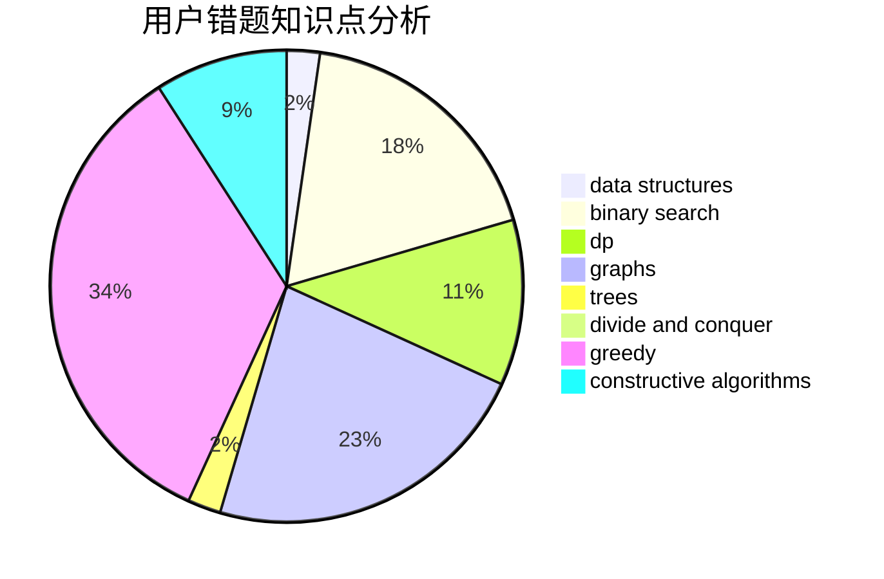

# Tony102

<!-- tabs:start -->

#### **用户提交结果分析**

#### **用户做题类型偏好分析**

#### **用户错题知识点分析**

<!-- tabs:end -->
# 推荐题目
[1164M](https://codeforces.com/contest/1164/problem/M)		dsu,graphs,sortings,trees		  
[868D](https://codeforces.com/contest/868/problem/D)		bitmasks,
                        brute force,
                        dp,
                        implementation,
                        strings		  
[1108A](https://codeforces.com/contest/1108/problem/A)		implementation		  
[934A](https://codeforces.com/contest/934/problem/A)		brute force,
                        games		  
[574C](https://codeforces.com/contest/574/problem/C)		dsu,graphs,sortings,trees		  
[1091H](https://codeforces.com/contest/1091/problem/H)		games		  
[1246D](https://codeforces.com/contest/1246/problem/D)		dsu,graphs,sortings,trees		  
[325D](https://codeforces.com/contest/325/problem/D)		dsu		  
[930A](https://codeforces.com/contest/930/problem/A)		dfs and similar,
                        graphs,
                        trees		  
[1087F](https://codeforces.com/contest/1087/problem/F)		dsu,graphs,sortings,trees		  
