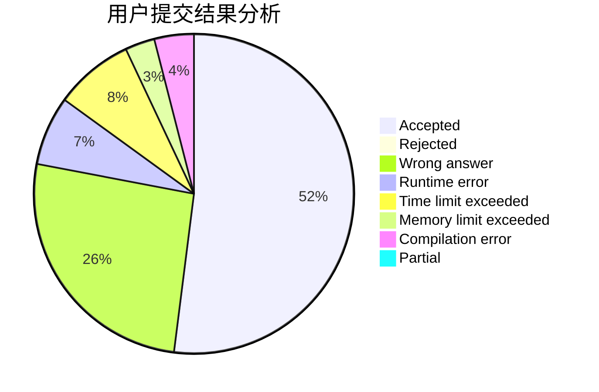
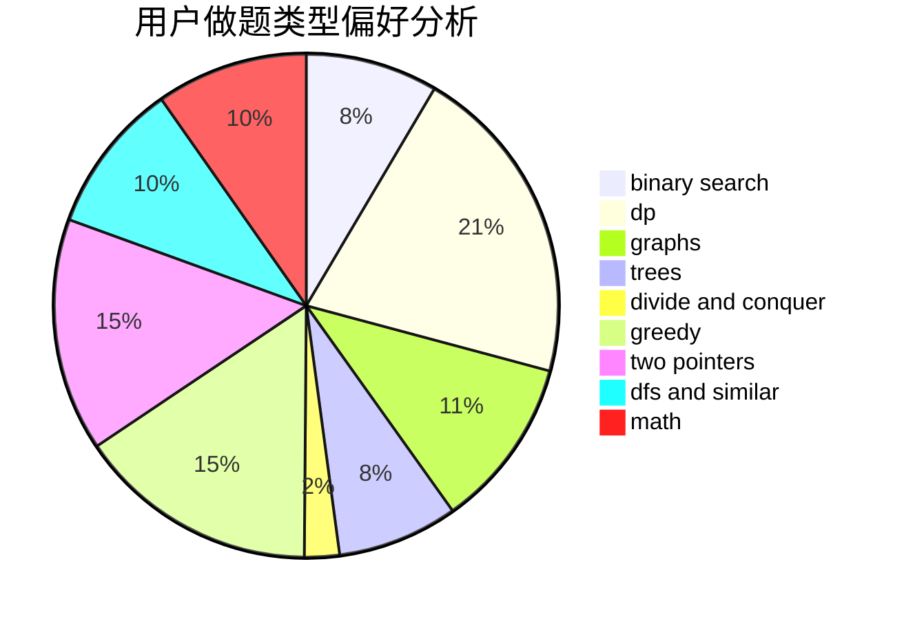

# Tony102

<!-- tabs:start -->

#### **用户提交结果分析**

#### **用户做题类型偏好分析**

<!-- tabs:end -->
# 推荐题目
[1164M](https://codeforces.com/contest/1164/problem/M)
[868D](https://codeforces.com/contest/868/problem/D)
[1108A](https://codeforces.com/contest/1108/problem/A)
[934A](https://codeforces.com/contest/934/problem/A)
[574C](https://codeforces.com/contest/574/problem/C)
[1091H](https://codeforces.com/contest/1091/problem/H)
[1246D](https://codeforces.com/contest/1246/problem/D)
[325D](https://codeforces.com/contest/325/problem/D)
[930A](https://codeforces.com/contest/930/problem/A)
[1087F](https://codeforces.com/contest/1087/problem/F)
