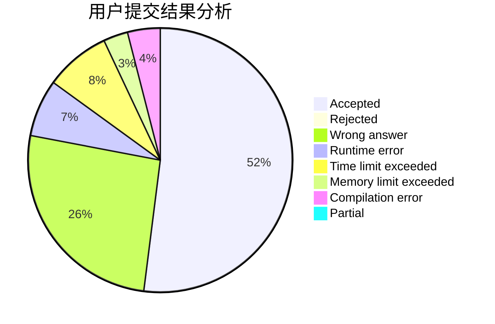
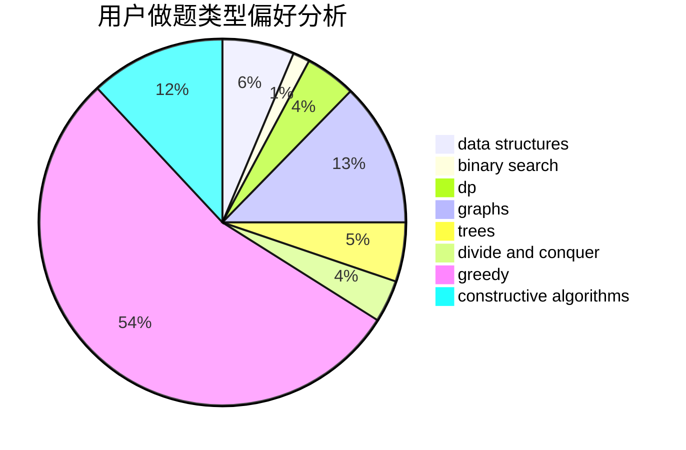
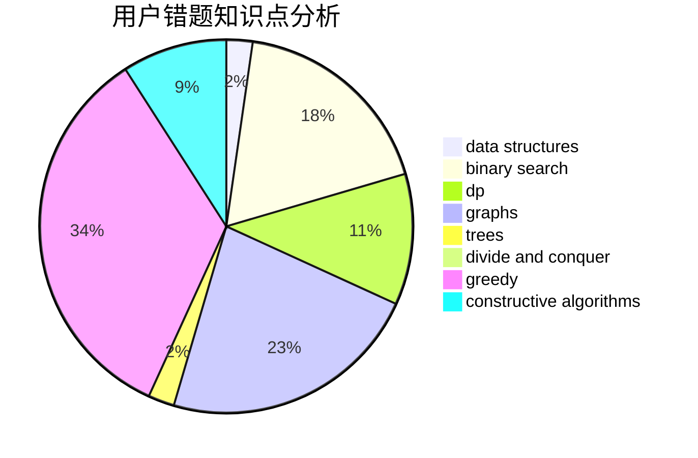

# Tony102

<!-- tabs:start -->

#### **用户提交结果分析**

#### **用户做题类型偏好分析**

#### **用户错题知识点分析**

<!-- tabs:end -->
# 推荐题目
[1162E](https://codeforces.com/contest/1162/problem/E)		dsu,graphs,sortings,trees		  
[849B](https://codeforces.com/contest/849/problem/B)		brute force,
                        geometry		  
[1107F](https://codeforces.com/contest/1107/problem/F)		dp,
                        flows,
                        graph matchings,
                        graphs,
                        sortings		  
[914E](https://codeforces.com/contest/914/problem/E)		bitmasks,
                        data structures,
                        divide and conquer,
                        trees		  
[549E](https://codeforces.com/contest/549/problem/E)		geometry,
                        math		  
[1091E](https://codeforces.com/contest/1091/problem/E)		binary search,
                        data structures,
                        graphs,
                        greedy,
                        implementation,
                        math,
                        sortings		  
[1241A](https://codeforces.com/contest/1241/problem/A)		dsu,graphs,sortings,trees		  
[305B](https://codeforces.com/contest/305/problem/B)		brute force,
                        implementation,
                        math		  
[911E](https://codeforces.com/contest/911/problem/E)		constructive algorithms,
                        data structures,
                        greedy,
                        implementation		  
[1087C](https://codeforces.com/contest/1087/problem/C)		dsu,graphs,sortings,trees		  
