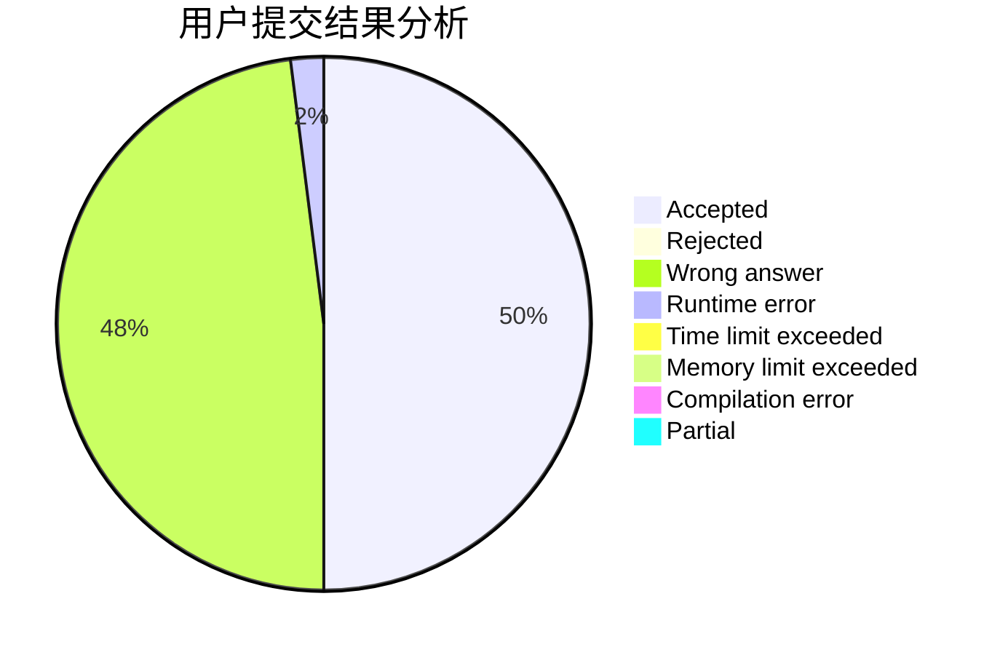
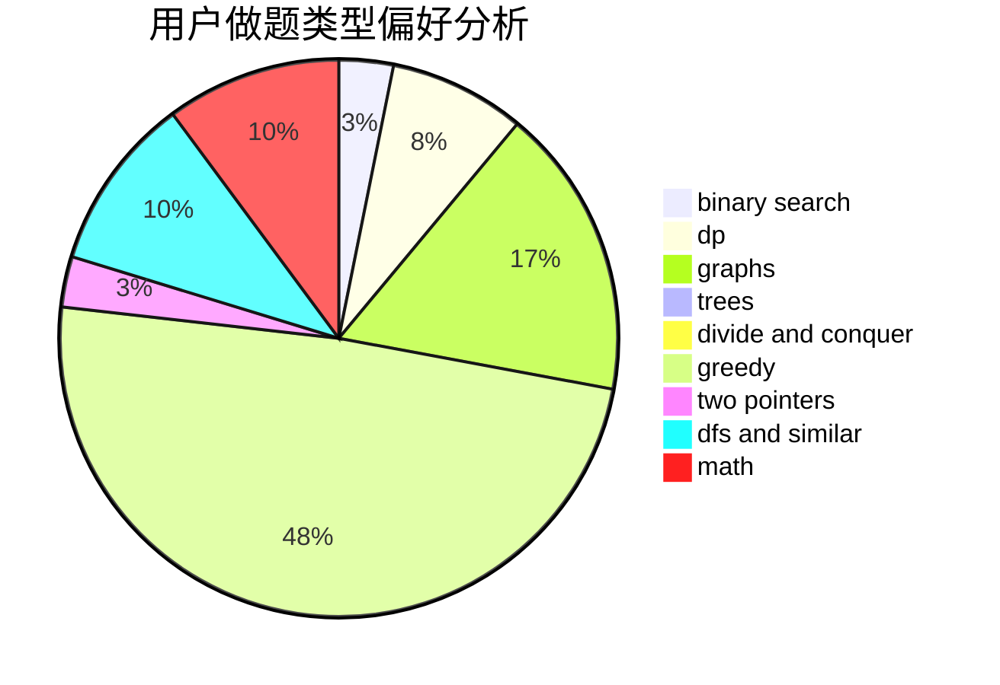

# Tonyell

<!-- tabs:start -->

#### **用户提交结果分析**

#### **用户做题类型偏好分析**

<!-- tabs:end -->
# 推荐题目
[656A](https://codeforces.com/contest/656/problem/A)
[1256C](https://codeforces.com/contest/1256/problem/C)
[1142D](https://codeforces.com/contest/1142/problem/D)
[464C](https://codeforces.com/contest/464/problem/C)
[131A](https://codeforces.com/contest/131/problem/A)
[1210E](https://codeforces.com/contest/1210/problem/E)
[376B](https://codeforces.com/contest/376/problem/B)
[1000C](https://codeforces.com/contest/1000/problem/C)
[114C](https://codeforces.com/contest/114/problem/C)
[514D](https://codeforces.com/contest/514/problem/D)
