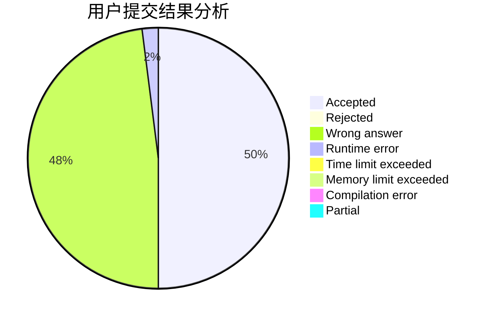
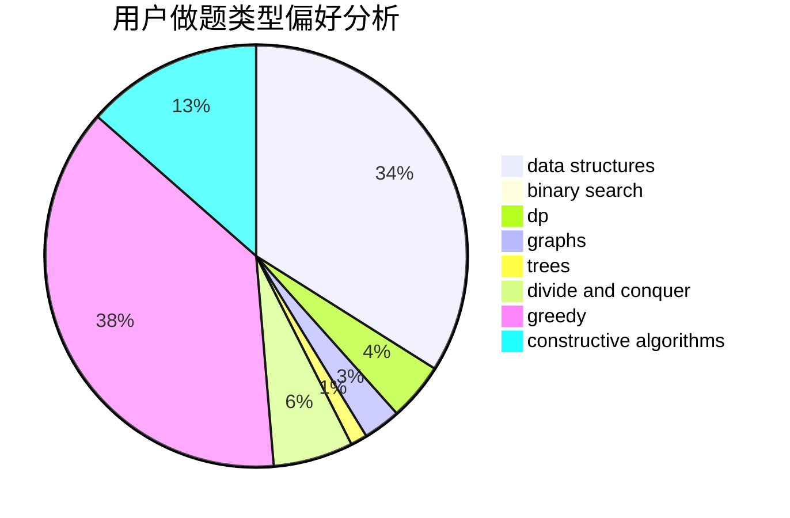
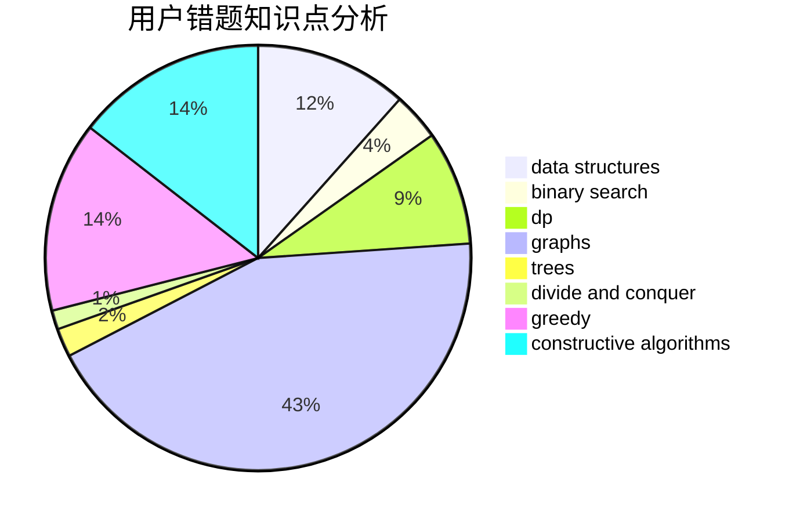

# Tonyell

<!-- tabs:start -->

#### **用户提交结果分析**

#### **用户做题类型偏好分析**

#### **用户错题知识点分析**

<!-- tabs:end -->
# 推荐题目
[628B](https://codeforces.com/contest/628/problem/B)		dp		  
[1251B](https://codeforces.com/contest/1251/problem/B)		greedy,
                        strings		  
[1140F](https://codeforces.com/contest/1140/problem/F)		data structures,
                        divide and conquer,
                        dsu		  
[444D](https://codeforces.com/contest/444/problem/D)		binary search,
                        hashing,
                        strings,
                        two pointers		  
[1310D](https://codeforces.com/contest/1310/problem/D)		dp,
                        graphs,
                        probabilities		  
[1206D](https://codeforces.com/contest/1206/problem/D)		dsu,graphs,sortings,trees		  
[34A](https://codeforces.com/contest/34/problem/A)		implementation		  
[1000C](https://codeforces.com/contest/1000/problem/C)		data structures,
                        implementation,
                        sortings		  
[1148C](https://codeforces.com/contest/1148/problem/C)		constructive algorithms,
                        sortings		  
[494C](https://codeforces.com/contest/494/problem/C)		dp,
                        probabilities		  
