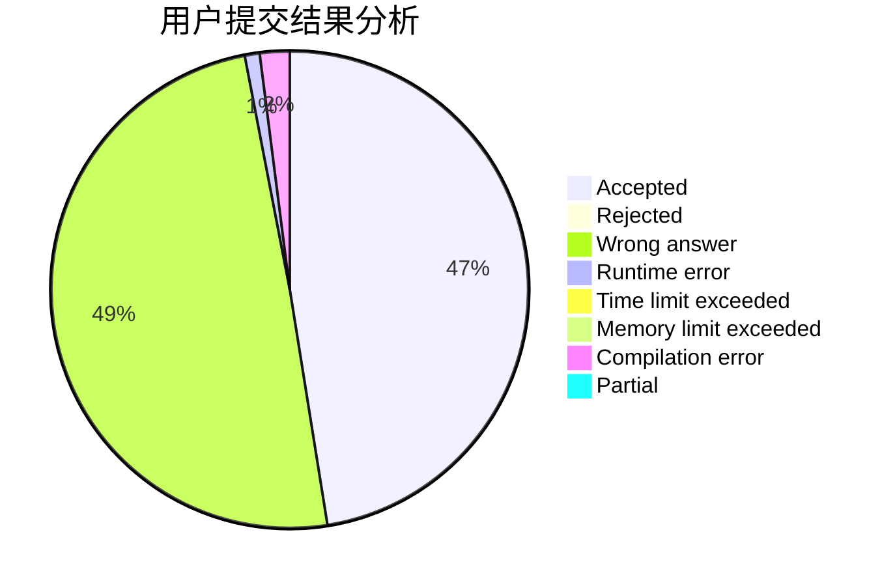
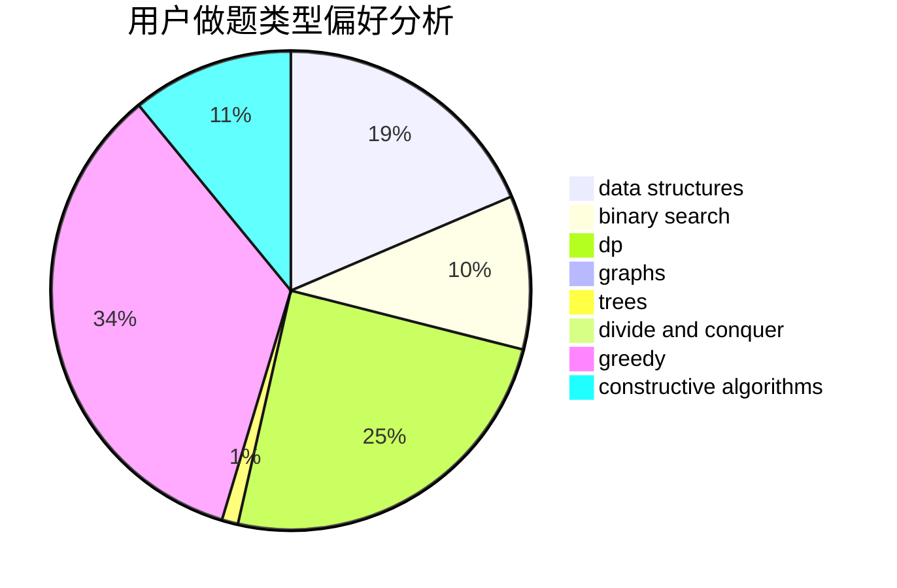
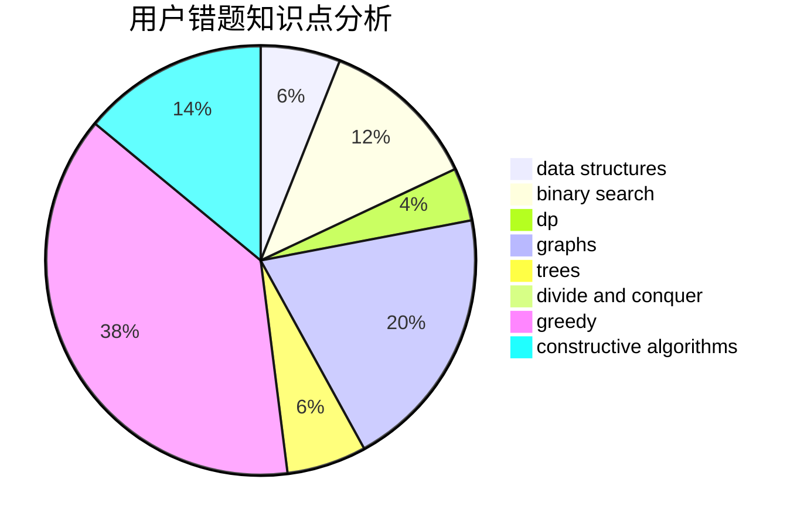

# TosakaUCW

<!-- tabs:start -->

#### **用户提交结果分析**

#### **用户做题类型偏好分析**

#### **用户错题知识点分析**

<!-- tabs:end -->
# 推荐题目
[1025D](https://codeforces.com/contest/1025/problem/D)		brute force,
                        dp,
                        math,
                        number theory,
                        trees		  
[1166E](https://codeforces.com/contest/1166/problem/E)		bitmasks,
                        brute force,
                        constructive algorithms,
                        math,
                        number theory		  
[1149A](https://codeforces.com/contest/1149/problem/A)		constructive algorithms,
                        greedy,
                        math,
                        number theory		  
[1025C](https://codeforces.com/contest/1025/problem/C)		constructive algorithms,
                        implementation		  
[687C](https://codeforces.com/contest/687/problem/C)		dp		  
[701B](https://codeforces.com/contest/701/problem/B)		data structures,
                        math		  
[1116C2](https://codeforces.com/contest/1116C/problem/2)		nan		  
[1172C1](https://codeforces.com/contest/1172C/problem/1)		dp,
                        probabilities		  
[553A](https://codeforces.com/contest/553/problem/A)		combinatorics,
                        dp,
                        math		  
[1238G](https://codeforces.com/contest/1238/problem/G)		data structures,
                        greedy,
                        sortings		  
