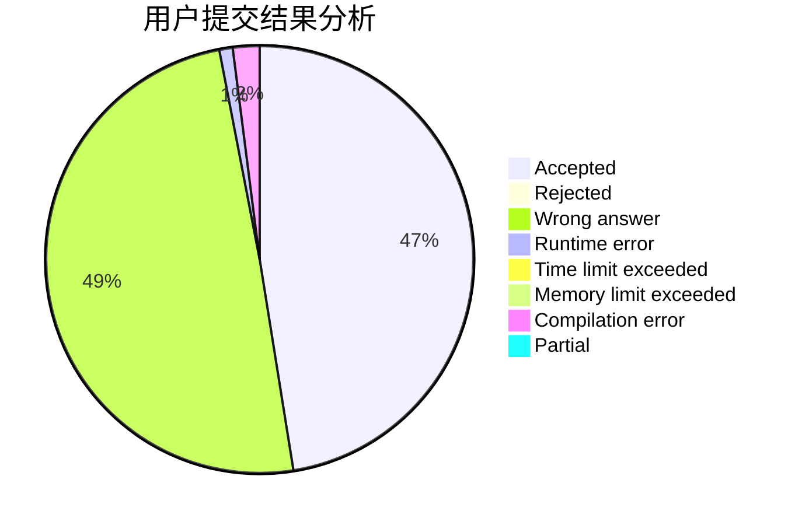
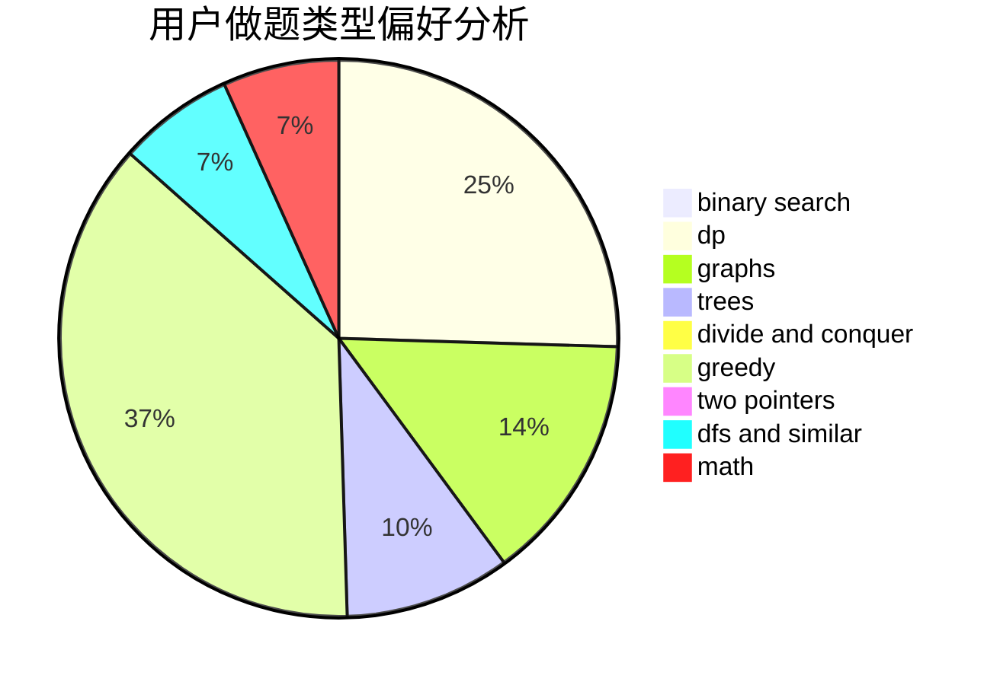

# TosakaUCW

<!-- tabs:start -->

#### **用户提交结果分析**

#### **用户做题类型偏好分析**

<!-- tabs:end -->
# 推荐题目
[1025G](https://codeforces.com/contest/1025/problem/G)
[116A](https://codeforces.com/contest/116/problem/A)
[1150D](https://codeforces.com/contest/1150/problem/D)
[1025F](https://codeforces.com/contest/1025/problem/F)
[709B](https://codeforces.com/contest/709/problem/B)
[719C](https://codeforces.com/contest/719/problem/C)
[11181](https://codeforces.com/contest/1118/problem/1)
[1174E](https://codeforces.com/contest/1174/problem/E)
[578C](https://codeforces.com/contest/578/problem/C)
[1244B](https://codeforces.com/contest/1244/problem/B)
