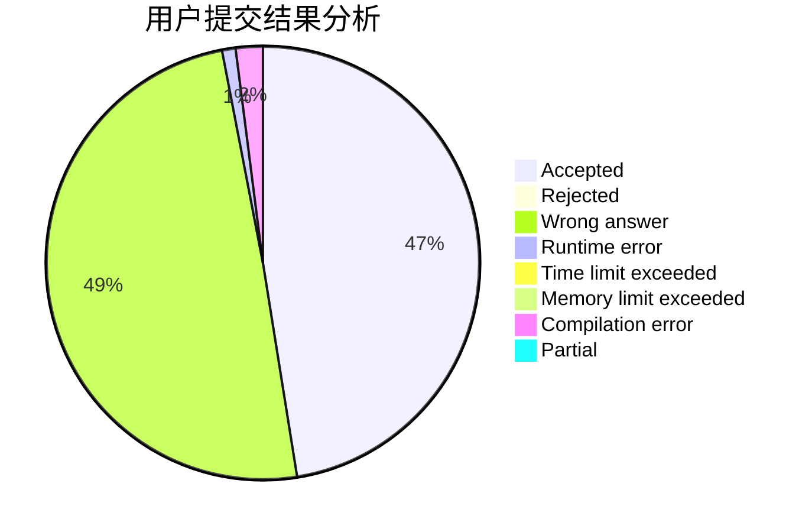
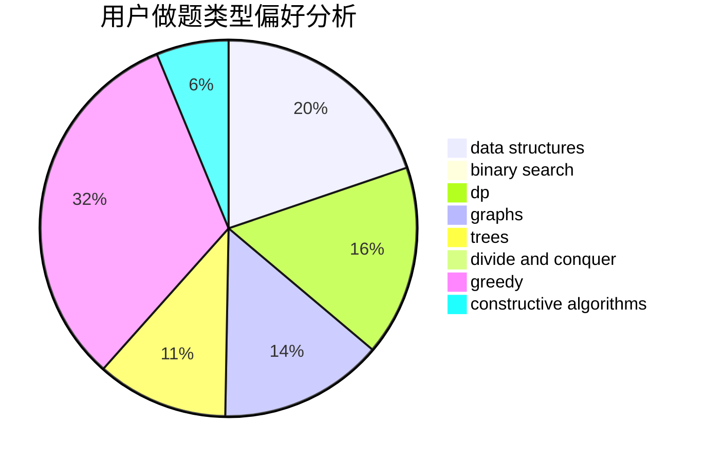

# TosakaUCW

<!-- tabs:start -->

#### **用户提交结果分析**

#### **用户做题类型偏好分析**

#### **用户错题知识点分析**

<!-- tabs:end -->
# 推荐题目
[1025G](https://codeforces.com/contest/1025/problem/G)		constructive algorithms,
                        math		  
[116A](https://codeforces.com/contest/116/problem/A)		implementation		  
[1150D](https://codeforces.com/contest/1150/problem/D)		dsu,graphs,sortings,trees		  
[1025F](https://codeforces.com/contest/1025/problem/F)		geometry		  
[709B](https://codeforces.com/contest/709/problem/B)		greedy,
                        implementation,
                        sortings		  
[719C](https://codeforces.com/contest/719/problem/C)		dsu,graphs,sortings,trees		  
[11181](https://codeforces.com/contest/1118/problem/1)		dsu,graphs,sortings,trees		  
[1174E](https://codeforces.com/contest/1174/problem/E)		combinatorics,
                        dp,
                        math,
                        number theory		  
[578C](https://codeforces.com/contest/578/problem/C)		ternary search		  
[1244B](https://codeforces.com/contest/1244/problem/B)		brute force,
                        implementation		  
