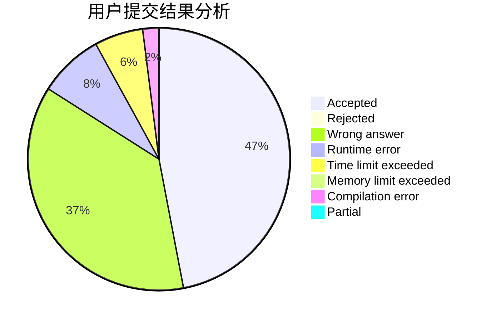
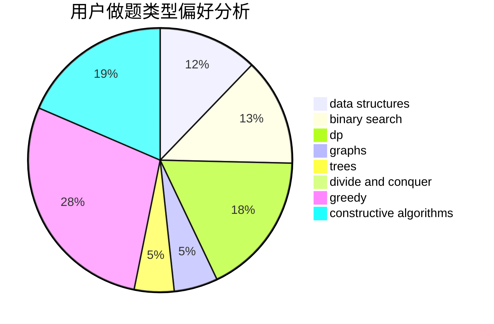
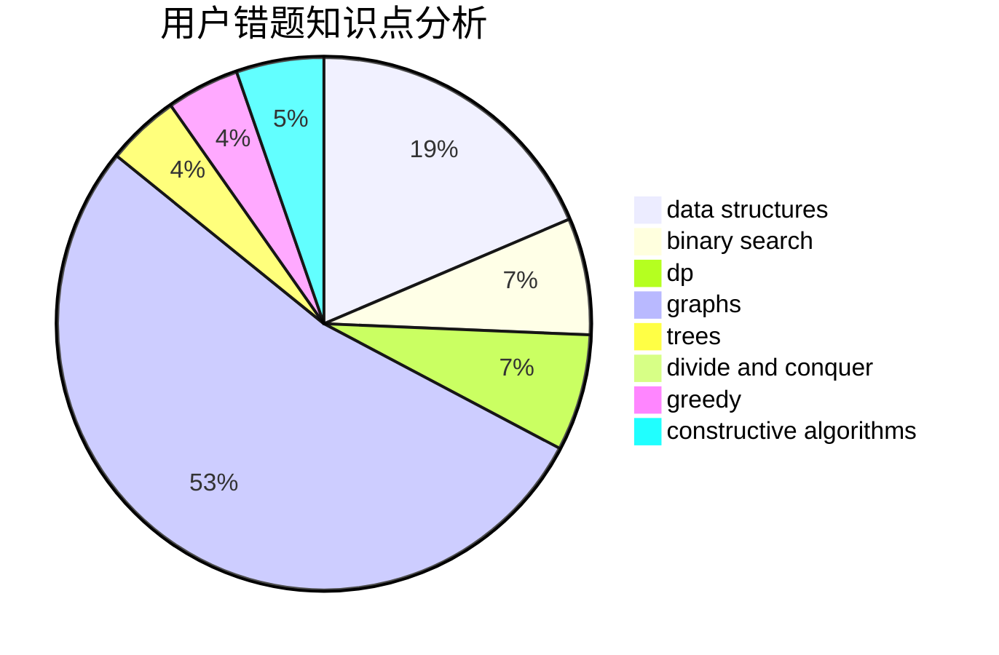

# TownYang

<!-- tabs:start -->

#### **用户提交结果分析**

#### **用户做题类型偏好分析**

#### **用户错题知识点分析**

<!-- tabs:end -->
# 推荐题目
[347A](https://codeforces.com/contest/347/problem/A)		constructive algorithms,
                        implementation,
                        sortings		  
[1200D](https://codeforces.com/contest/1200/problem/D)		brute force,
                        data structures,
                        dp,
                        implementation,
                        two pointers		  
[1070M](https://codeforces.com/contest/1070/problem/M)		constructive algorithms,
                        divide and conquer,
                        geometry		  
[11631](https://codeforces.com/contest/1163/problem/1)		dsu,graphs,sortings,trees		  
[1312E](https://codeforces.com/contest/1312/problem/E)		dp,
                        greedy		  
[10151](https://codeforces.com/contest/1015/problem/1)		dsu,graphs,sortings,trees		  
[1113F](https://codeforces.com/contest/1113/problem/F)		dsu,graphs,sortings,trees		  
[1347D](https://codeforces.com/contest/1347/problem/D)		dsu,graphs,sortings,trees		  
[890C](https://codeforces.com/contest/890/problem/C)		dsu,graphs,sortings,trees		  
[1063D](https://codeforces.com/contest/1063/problem/D)		brute force,
                        math		  
