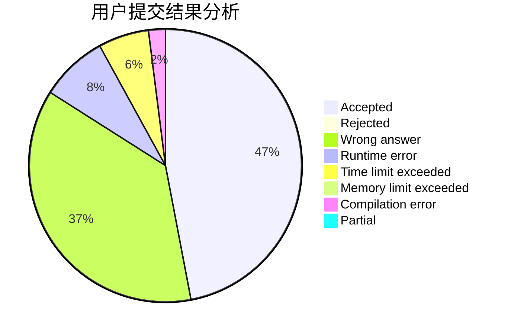
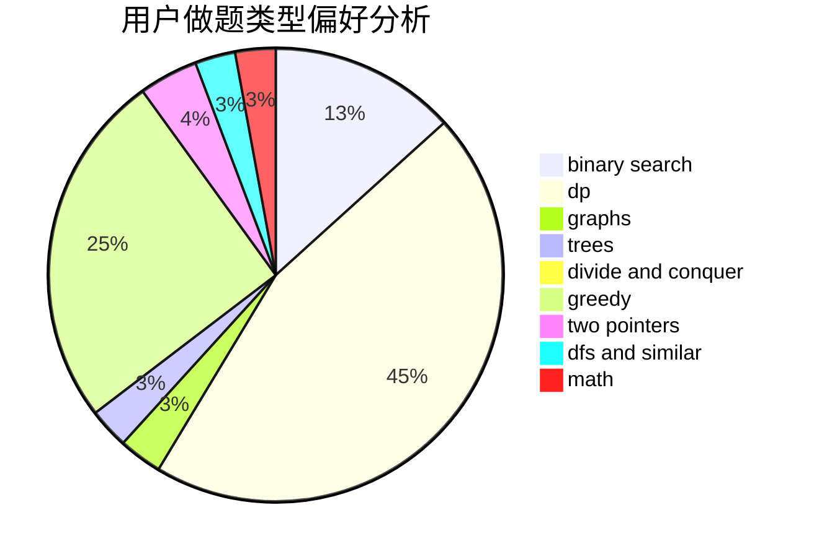

# TownYang

<!-- tabs:start -->

#### **用户提交结果分析**

#### **用户做题类型偏好分析**

<!-- tabs:end -->
# 推荐题目
[347A](https://codeforces.com/contest/347/problem/A)
[1200D](https://codeforces.com/contest/1200/problem/D)
[1070M](https://codeforces.com/contest/1070/problem/M)
[11631](https://codeforces.com/contest/1163/problem/1)
[1312E](https://codeforces.com/contest/1312/problem/E)
[10151](https://codeforces.com/contest/1015/problem/1)
[1113F](https://codeforces.com/contest/1113/problem/F)
[1347D](https://codeforces.com/contest/1347/problem/D)
[890C](https://codeforces.com/contest/890/problem/C)
[1063D](https://codeforces.com/contest/1063/problem/D)
