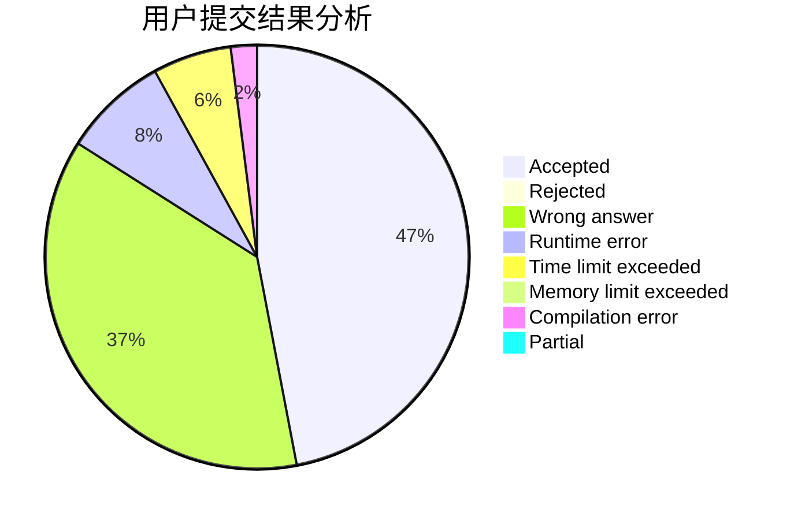
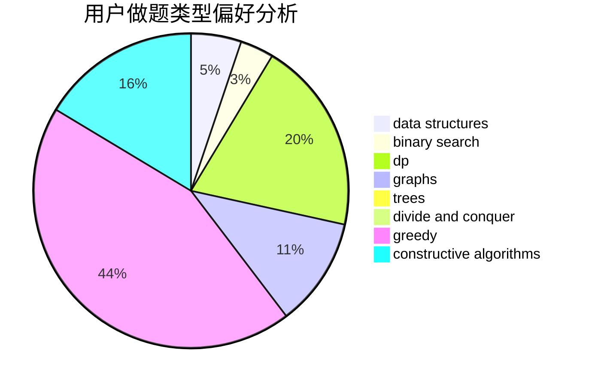
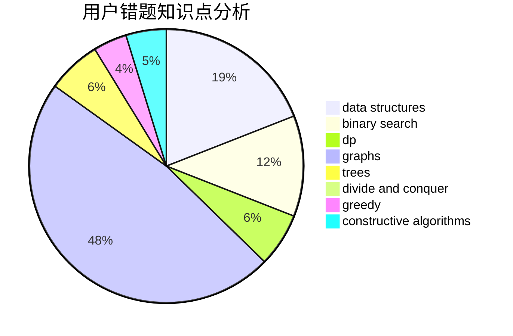

# TownYang

<!-- tabs:start -->

#### **用户提交结果分析**

#### **用户做题类型偏好分析**

#### **用户错题知识点分析**

<!-- tabs:end -->
# 推荐题目
[317D](https://codeforces.com/contest/317/problem/D)		dp,
                        games		  
[1197B](https://codeforces.com/contest/1197/problem/B)		greedy,
                        implementation		  
[1070J](https://codeforces.com/contest/1070/problem/J)		dp		  
[115B](https://codeforces.com/contest/115/problem/B)		greedy,
                        sortings		  
[1303G](https://codeforces.com/contest/1303/problem/G)		data structures,
                        divide and conquer,
                        geometry,
                        trees		  
[1013C](https://codeforces.com/contest/1013/problem/C)		dsu,graphs,sortings,trees		  
[1113B](https://codeforces.com/contest/1113/problem/B)		greedy,
                        number theory		  
[1340E](https://codeforces.com/contest/1340/problem/E)		graphs,
                        interactive,
                        probabilities		  
[870B](https://codeforces.com/contest/870/problem/B)		greedy		  
[1063A](https://codeforces.com/contest/1063/problem/A)		constructive algorithms,
                        strings		  
