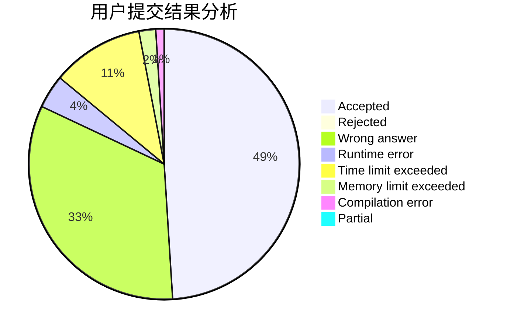
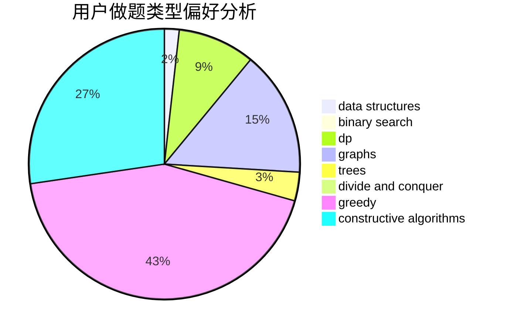
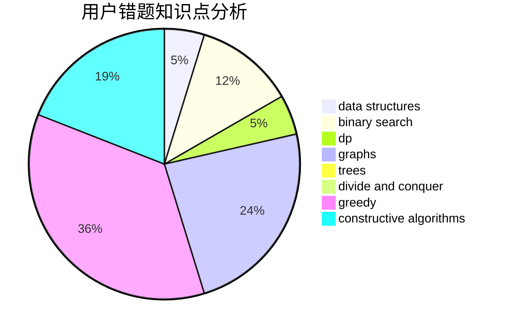

# Toxel

<!-- tabs:start -->

#### **用户提交结果分析**

#### **用户做题类型偏好分析**

#### **用户错题知识点分析**

<!-- tabs:end -->
# 推荐题目
[1361D](https://codeforces.com/contest/1361/problem/D)		greedy,
                        implementation,
                        math,
                        trees		  
[677C](https://codeforces.com/contest/677/problem/C)		bitmasks,
                        combinatorics,
                        implementation,
                        strings		  
[97D](https://codeforces.com/contest/97/problem/D)		bitmasks,
                        brute force,
                        implementation		  
[861A](https://codeforces.com/contest/861/problem/A)		dsu,graphs,sortings,trees		  
[421A](https://codeforces.com/contest/421/problem/A)		constructive algorithms,
                        implementation		  
[52C](https://codeforces.com/contest/52/problem/C)		data structures		  
[1137B](https://codeforces.com/contest/1137/problem/B)		greedy,
                        hashing,
                        strings		  
[1145A](https://codeforces.com/contest/1145/problem/A)		implementation		  
[276C](https://codeforces.com/contest/276/problem/C)		data structures,
                        greedy,
                        implementation,
                        sortings		  
[5132](https://codeforces.com/contest/513/problem/2)		dsu,graphs,sortings,trees		  
