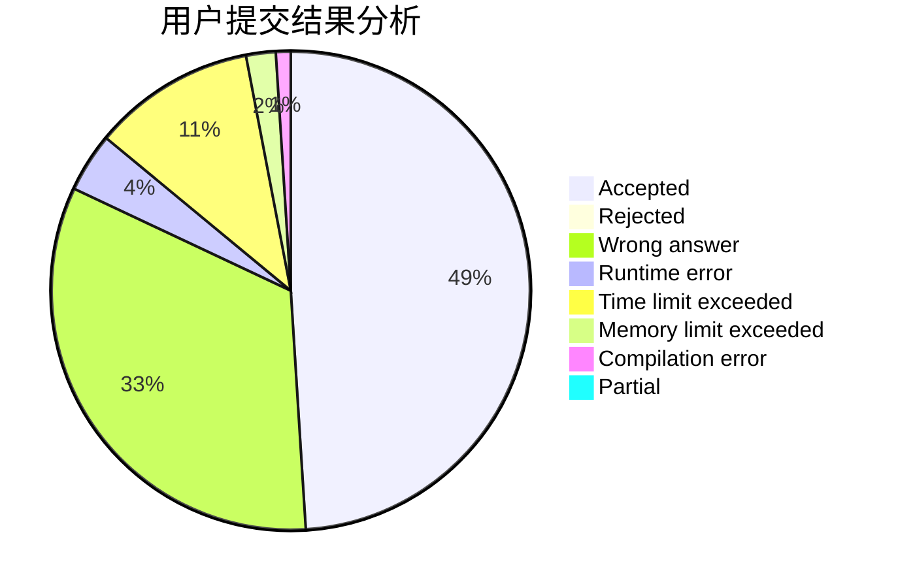
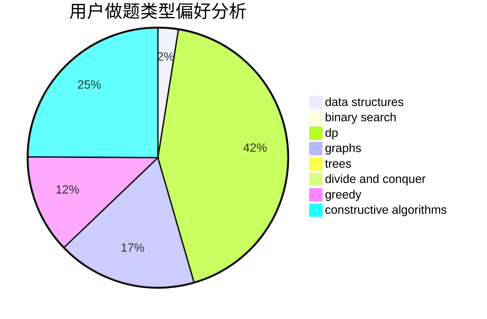
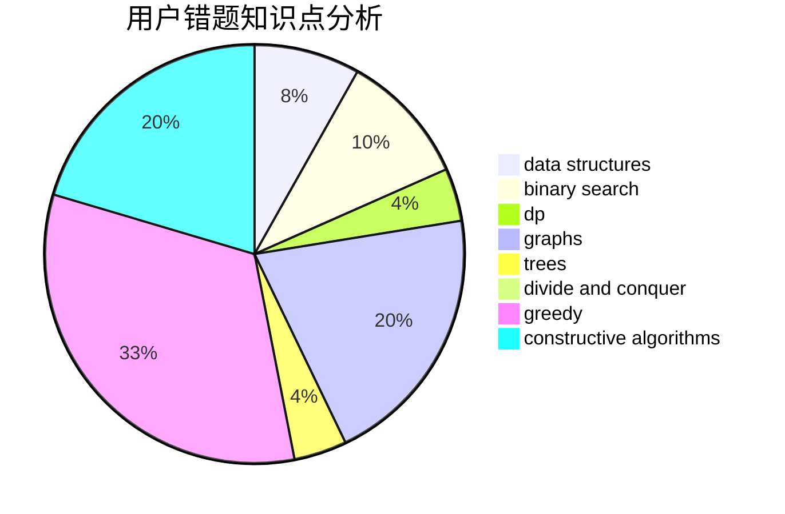

# Toxel

<!-- tabs:start -->

#### **用户提交结果分析**

#### **用户做题类型偏好分析**

#### **用户错题知识点分析**

<!-- tabs:end -->
# 推荐题目
[1354G](https://codeforces.com/contest/1354/problem/G)		binary search,
                        interactive,
                        probabilities		  
[653C](https://codeforces.com/contest/653/problem/C)		brute force,
                        implementation		  
[958D1](https://codeforces.com/contest/958D/problem/1)		expression parsing,
                        math		  
[842B](https://codeforces.com/contest/842/problem/B)		geometry		  
[392B](https://codeforces.com/contest/392/problem/B)		dp		  
[509D](https://codeforces.com/contest/509/problem/D)		constructive algorithms,
                        math		  
[1133A](https://codeforces.com/contest/1133/problem/A)		implementation		  
[1143A](https://codeforces.com/contest/1143/problem/A)		implementation		  
[258D](https://codeforces.com/contest/258/problem/D)		dp,
                        math,
                        probabilities		  
[492E](https://codeforces.com/contest/492/problem/E)		math		  
