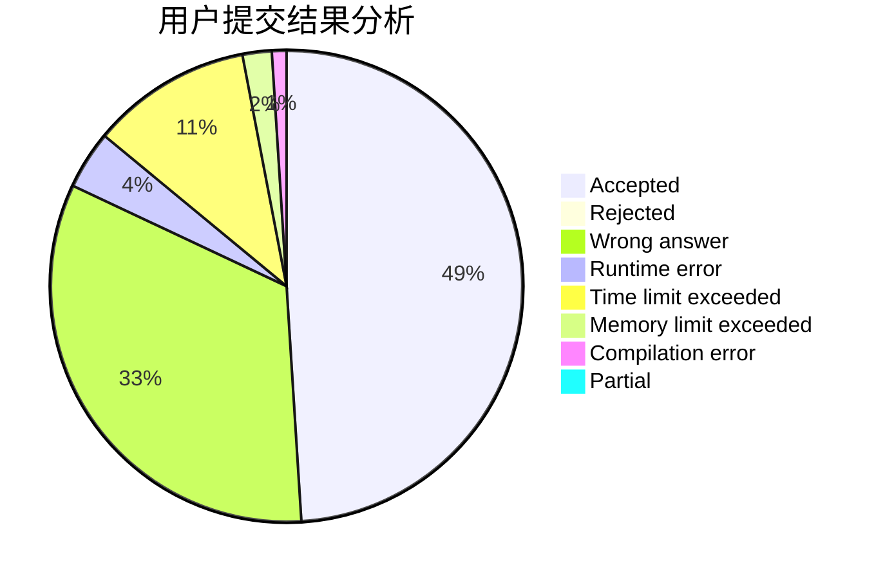
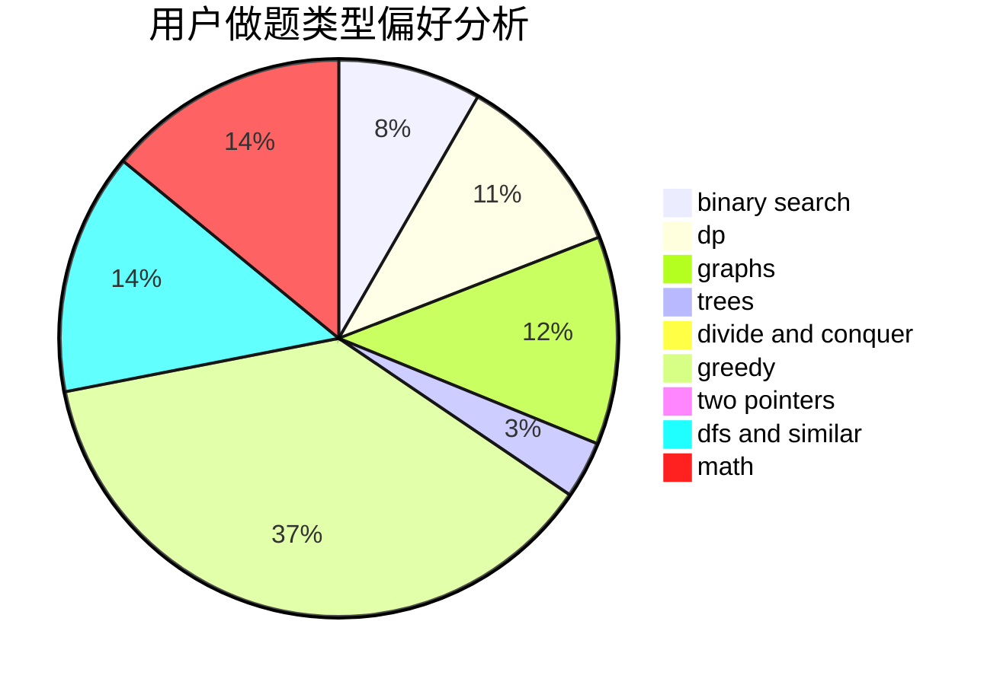

# Toxel

<!-- tabs:start -->

#### **用户提交结果分析**

#### **用户做题类型偏好分析**

<!-- tabs:end -->
# 推荐题目
[1361D](https://codeforces.com/contest/1361/problem/D)
[677C](https://codeforces.com/contest/677/problem/C)
[97D](https://codeforces.com/contest/97/problem/D)
[861A](https://codeforces.com/contest/861/problem/A)
[421A](https://codeforces.com/contest/421/problem/A)
[52C](https://codeforces.com/contest/52/problem/C)
[1137B](https://codeforces.com/contest/1137/problem/B)
[1145A](https://codeforces.com/contest/1145/problem/A)
[276C](https://codeforces.com/contest/276/problem/C)
[5132](https://codeforces.com/contest/513/problem/2)
