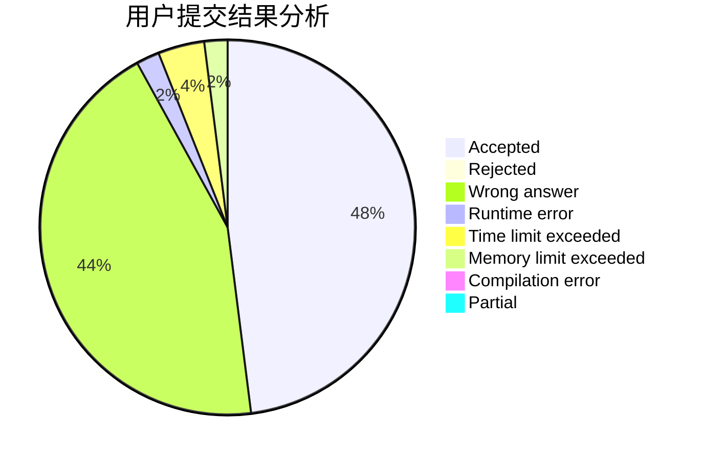
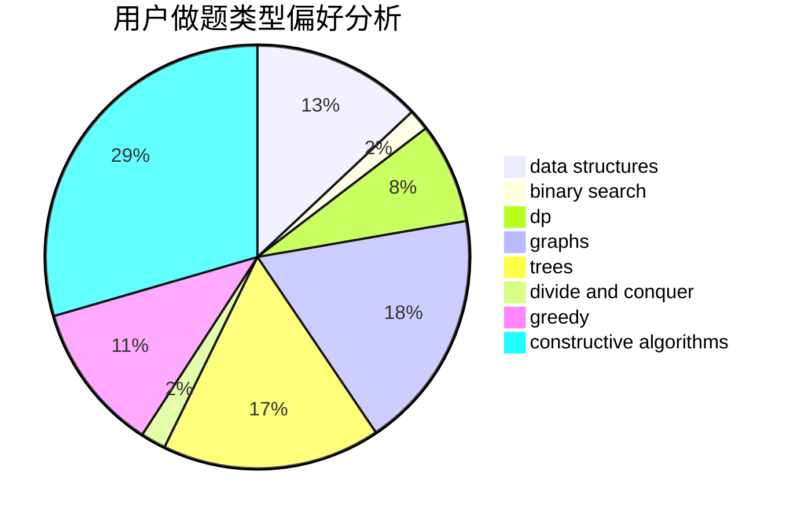

# Toxtricity

<!-- tabs:start -->

#### **用户提交结果分析**

#### **用户做题类型偏好分析**

#### **用户错题知识点分析**

<!-- tabs:end -->
# 推荐题目
[1443E](https://codeforces.com/contest/1443/problem/E)		brute force,
                        math,
                        two pointers		  
[1406E](https://codeforces.com/contest/1406/problem/E)		interactive,
                        math,
                        number theory		  
[1208C](https://codeforces.com/contest/1208/problem/C)		constructive algorithms		  
[959F](https://codeforces.com/contest/959/problem/F)		bitmasks,
                        dp,
                        math,
                        matrices		  
[887E](https://codeforces.com/contest/887/problem/E)		binary search,
                        geometry,
                        sortings		  
[1133A](https://codeforces.com/contest/1133/problem/A)		implementation		  
[981A](https://codeforces.com/contest/981/problem/A)		brute force,
                        implementation,
                        strings		  
[612C](https://codeforces.com/contest/612/problem/C)		data structures,
                        expression parsing,
                        math		  
[954H](https://codeforces.com/contest/954/problem/H)		combinatorics,
                        dp		  
[662A](https://codeforces.com/contest/662/problem/A)		bitmasks,
                        math,
                        matrices,
                        probabilities		  
