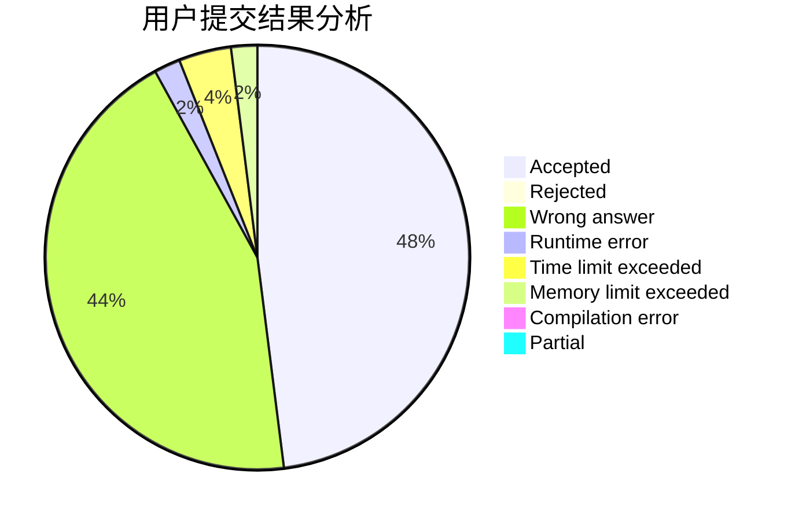
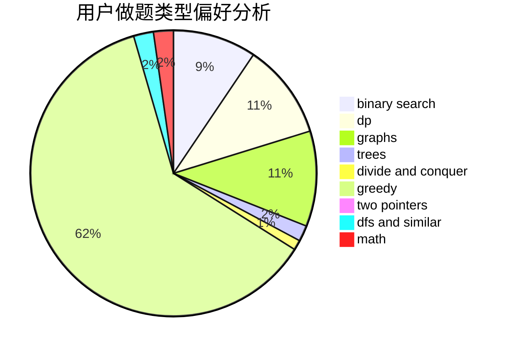

# Toxtricity

<!-- tabs:start -->

#### **用户提交结果分析**

#### **用户做题类型偏好分析**

<!-- tabs:end -->
# 推荐题目
[1453C](https://codeforces.com/contest/1453/problem/C)
[1417E](https://codeforces.com/contest/1417/problem/E)
[1213G](https://codeforces.com/contest/1213/problem/G)
[981D](https://codeforces.com/contest/981/problem/D)
[907A](https://codeforces.com/contest/907/problem/A)
[1137B](https://codeforces.com/contest/1137/problem/B)
[996B](https://codeforces.com/contest/996/problem/B)
[631E](https://codeforces.com/contest/631/problem/E)
[976E](https://codeforces.com/contest/976/problem/E)
[682A](https://codeforces.com/contest/682/problem/A)
