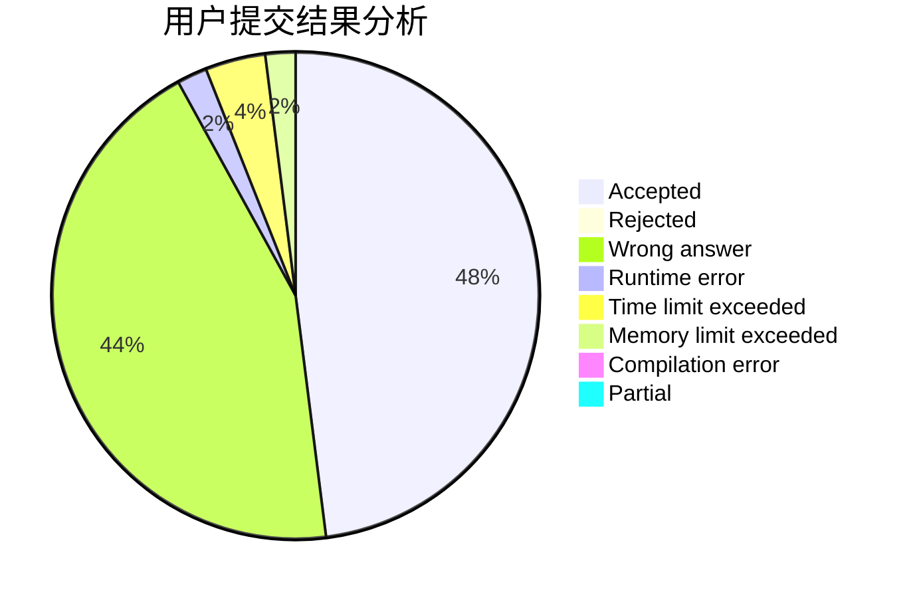
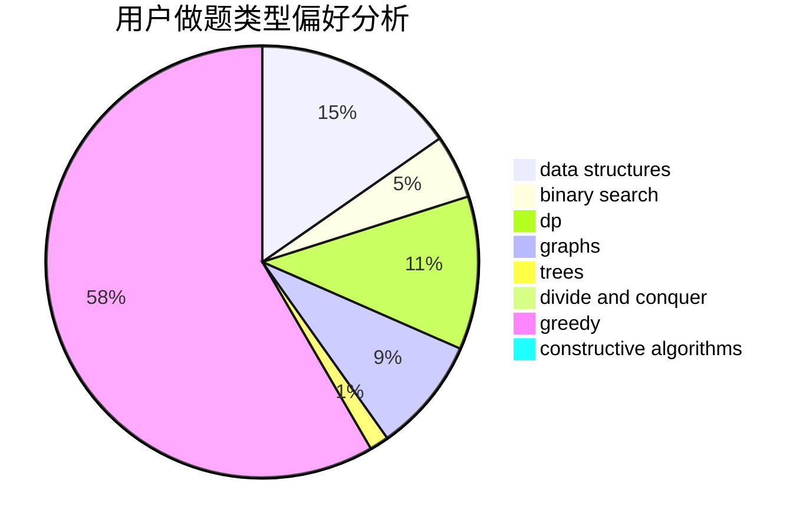

# Toxtricity

<!-- tabs:start -->

#### **用户提交结果分析**

#### **用户做题类型偏好分析**

#### **用户错题知识点分析**

<!-- tabs:end -->
# 推荐题目
[1453C](https://codeforces.com/contest/1453/problem/C)		greedy,
                        implementation		  
[1417E](https://codeforces.com/contest/1417/problem/E)		dsu,graphs,sortings,trees		  
[1213G](https://codeforces.com/contest/1213/problem/G)		divide and conquer,
                        dsu,
                        graphs,
                        sortings,
                        trees		  
[981D](https://codeforces.com/contest/981/problem/D)		bitmasks,
                        dp,
                        greedy		  
[907A](https://codeforces.com/contest/907/problem/A)		brute force,
                        implementation		  
[1137B](https://codeforces.com/contest/1137/problem/B)		greedy,
                        hashing,
                        strings		  
[996B](https://codeforces.com/contest/996/problem/B)		binary search,
                        math		  
[631E](https://codeforces.com/contest/631/problem/E)		data structures,
                        dp,
                        geometry		  
[976E](https://codeforces.com/contest/976/problem/E)		greedy,
                        sortings		  
[682A](https://codeforces.com/contest/682/problem/A)		constructive algorithms,
                        math,
                        number theory		  
