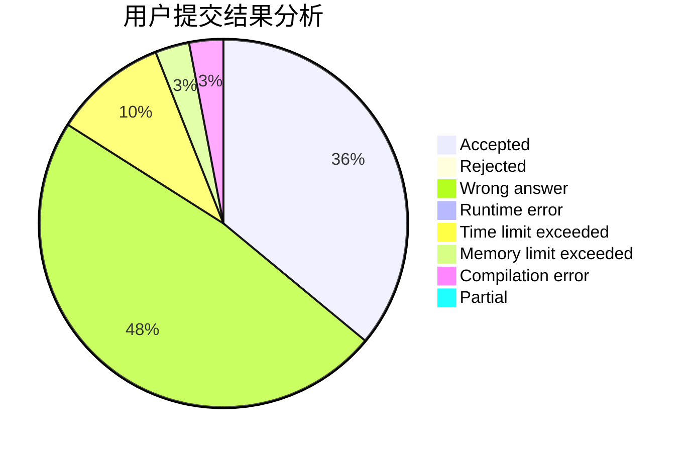
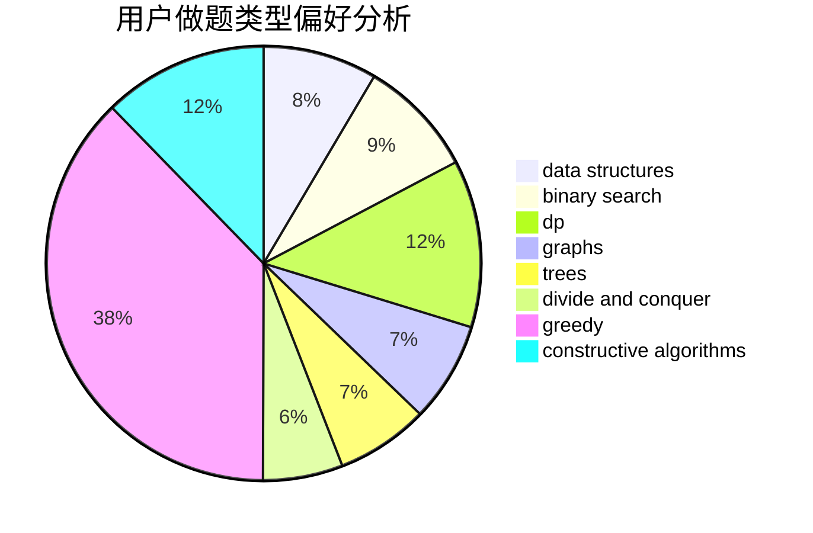
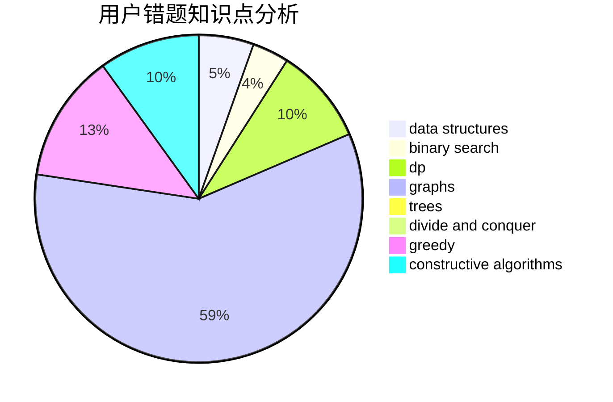

# AfLZK

<!-- tabs:start -->

#### **用户提交结果分析**

#### **用户做题类型偏好分析**

#### **用户错题知识点分析**

<!-- tabs:end -->
# 推荐题目
[20C](https://codeforces.com/contest/20/problem/C)		graphs,
                        shortest paths		  
[201C](https://codeforces.com/contest/201/problem/C)		dp		  
[208A](https://codeforces.com/contest/208/problem/A)		strings		  
[20A](https://codeforces.com/contest/20/problem/A)		implementation		  
[1380F](https://codeforces.com/contest/1380/problem/F)		data structures,
                        dp,
                        matrices		  
[17C](https://codeforces.com/contest/17/problem/C)		dp		  
[1045E](https://codeforces.com/contest/1045/problem/E)		constructive algorithms,
                        geometry		  
[205D](https://codeforces.com/contest/205/problem/D)		dsu,graphs,sortings,trees		  
[1034E](https://codeforces.com/contest/1034/problem/E)		bitmasks,
                        dp,
                        math		  
[158E](https://codeforces.com/contest/158/problem/E)		*special problem,
                        dp,
                        sortings		  
