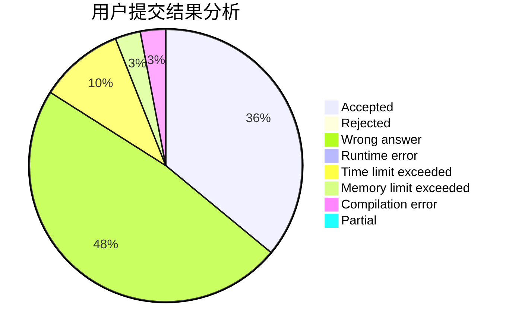
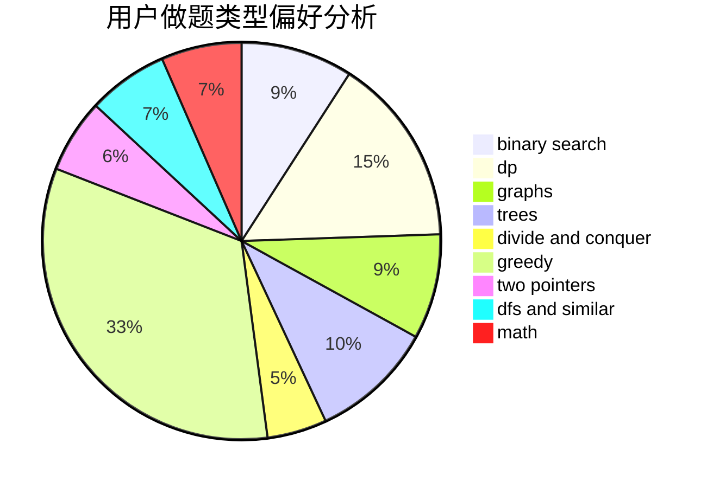

# AfLZK

<!-- tabs:start -->

#### **用户提交结果分析**

#### **用户做题类型偏好分析**

<!-- tabs:end -->
# 推荐题目
[20C](https://codeforces.com/contest/20/problem/C)
[201C](https://codeforces.com/contest/201/problem/C)
[208A](https://codeforces.com/contest/208/problem/A)
[20A](https://codeforces.com/contest/20/problem/A)
[1380F](https://codeforces.com/contest/1380/problem/F)
[17C](https://codeforces.com/contest/17/problem/C)
[1045E](https://codeforces.com/contest/1045/problem/E)
[205D](https://codeforces.com/contest/205/problem/D)
[1034E](https://codeforces.com/contest/1034/problem/E)
[158E](https://codeforces.com/contest/158/problem/E)
