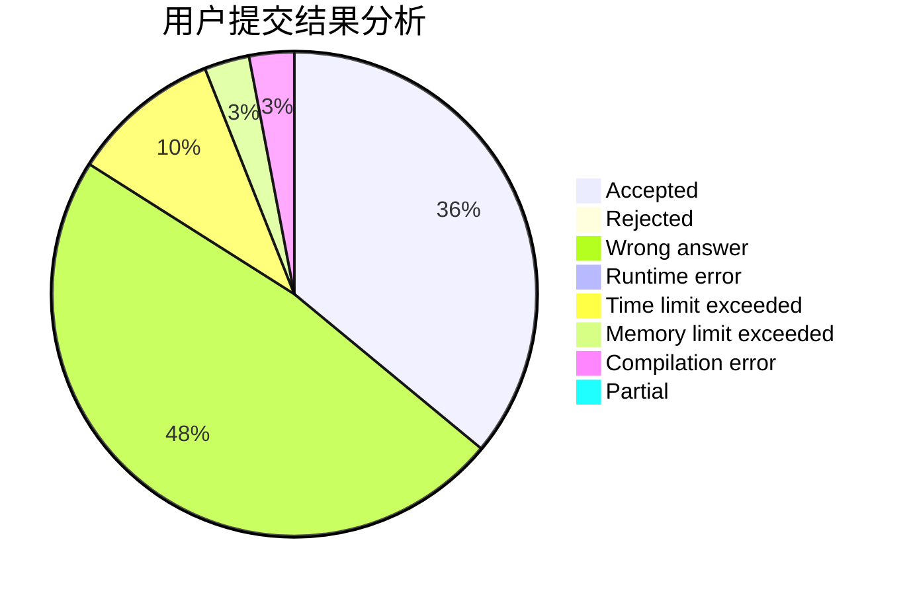
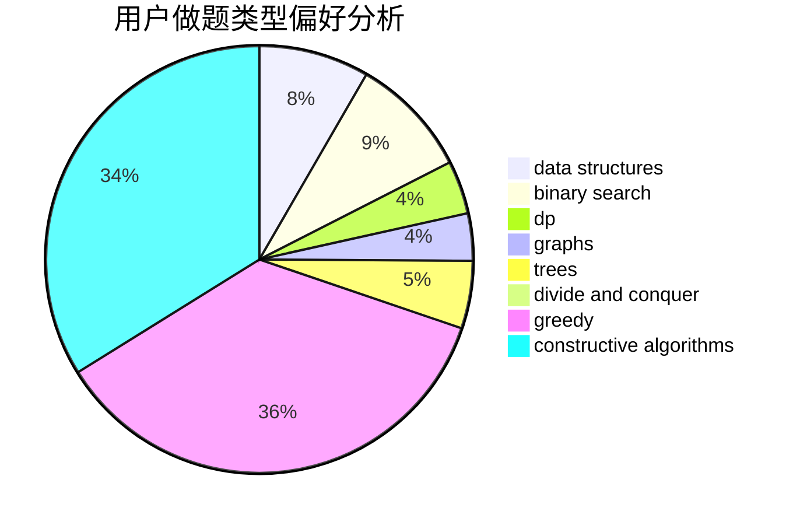
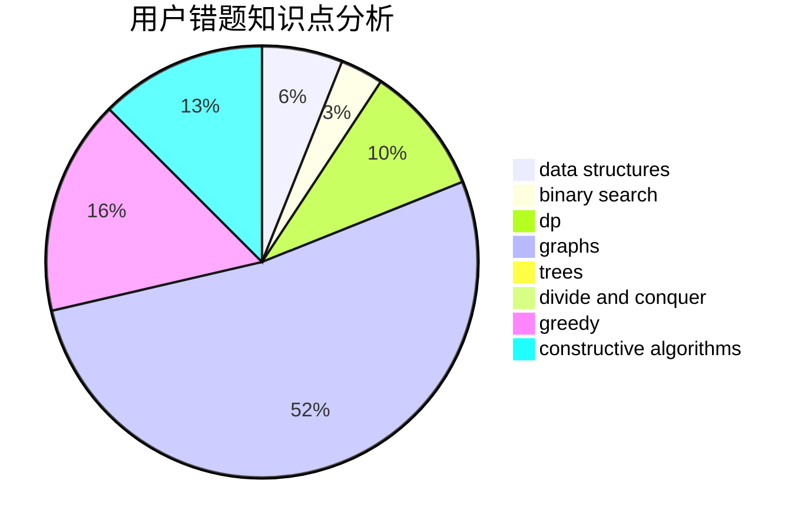

# AfLZK

<!-- tabs:start -->

#### **用户提交结果分析**

#### **用户做题类型偏好分析**

#### **用户错题知识点分析**

<!-- tabs:end -->
# 推荐题目
[185E](https://codeforces.com/contest/185/problem/E)		binary search,
                        data structures		  
[176D](https://codeforces.com/contest/176/problem/D)		dp		  
[180D](https://codeforces.com/contest/180/problem/D)		greedy,
                        strings		  
[183D](https://codeforces.com/contest/183/problem/D)		dp,
                        greedy,
                        probabilities		  
[1372A](https://codeforces.com/contest/1372/problem/A)		constructive algorithms,
                        implementation		  
[158A](https://codeforces.com/contest/158/problem/A)		*special problem,
                        implementation		  
[1044D](https://codeforces.com/contest/1044/problem/D)		data structures,
                        dsu		  
[180C](https://codeforces.com/contest/180/problem/C)		dp		  
[1034B](https://codeforces.com/contest/1034/problem/B)		brute force,
                        constructive algorithms,
                        flows,
                        graph matchings		  
[1508A](https://codeforces.com/contest/1508/problem/A)		constructive algorithms,
                        greedy,
                        implementation,
                        math,
                        strings,
                        two pointers		  
