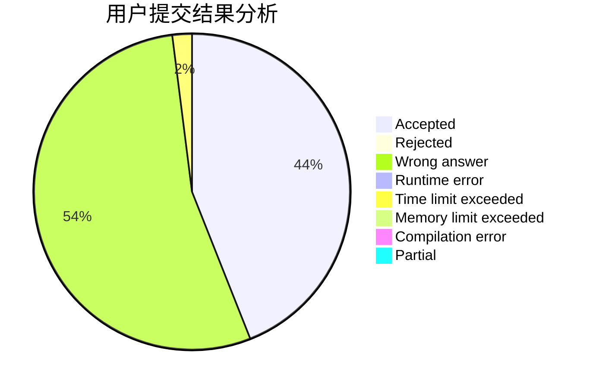
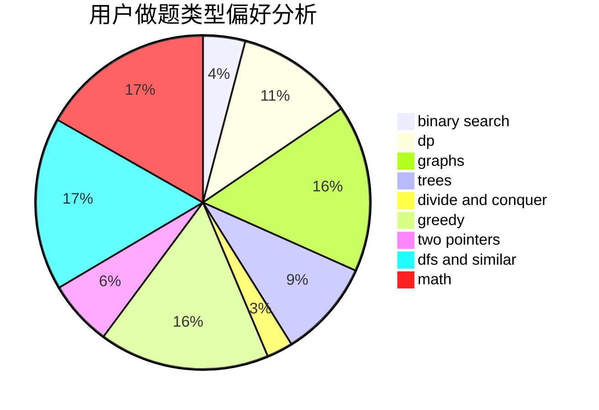

# TraceOnSnow

<!-- tabs:start -->

#### **用户提交结果分析**

#### **用户做题类型偏好分析**

<!-- tabs:end -->
# 推荐题目
[799D](https://codeforces.com/contest/799/problem/D)
[859E](https://codeforces.com/contest/859/problem/E)
[949B](https://codeforces.com/contest/949/problem/B)
[600C](https://codeforces.com/contest/600/problem/C)
[558A](https://codeforces.com/contest/558/problem/A)
[989E](https://codeforces.com/contest/989/problem/E)
[710E](https://codeforces.com/contest/710/problem/E)
[317B](https://codeforces.com/contest/317/problem/B)
[243B](https://codeforces.com/contest/243/problem/B)
[1095F](https://codeforces.com/contest/1095/problem/F)
