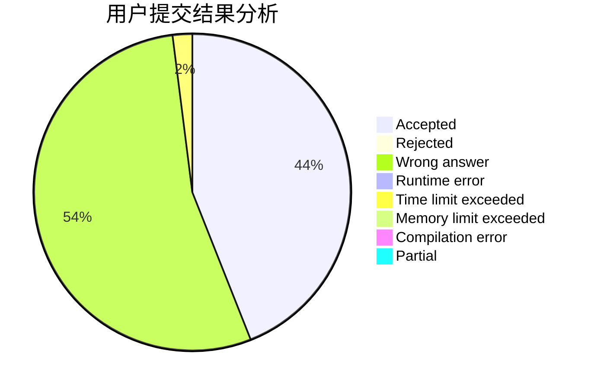
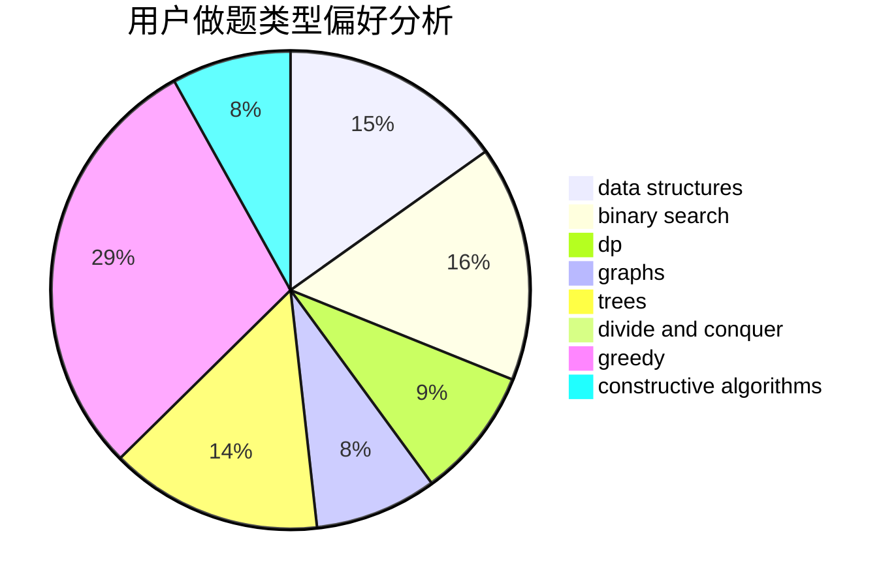
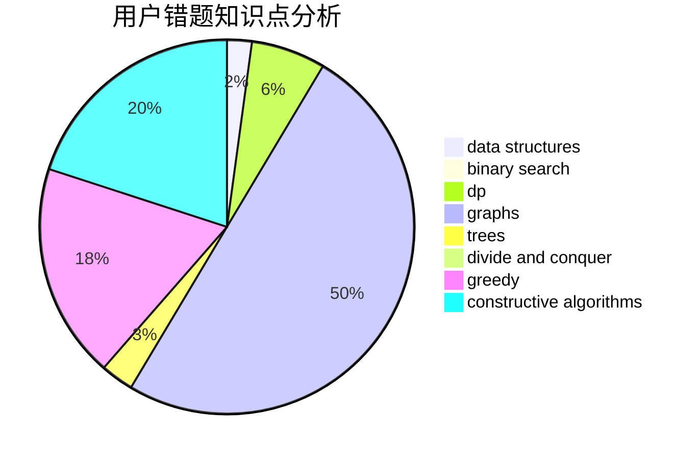

# TraceOnSnow

<!-- tabs:start -->

#### **用户提交结果分析**

#### **用户做题类型偏好分析**

#### **用户错题知识点分析**

<!-- tabs:end -->
# 推荐题目
[780E](https://codeforces.com/contest/780/problem/E)		constructive algorithms,
                        dfs and similar,
                        graphs		  
[840A](https://codeforces.com/contest/840/problem/A)		combinatorics,
                        greedy,
                        math,
                        number theory,
                        sortings		  
[925E](https://codeforces.com/contest/925/problem/E)		data structures,
                        trees		  
[580A](https://codeforces.com/contest/580/problem/A)		brute force,
                        dp,
                        implementation		  
[535C](https://codeforces.com/contest/535/problem/C)		binary search,
                        greedy,
                        math		  
[975A](https://codeforces.com/contest/975/problem/A)		implementation,
                        strings		  
[691A](https://codeforces.com/contest/691/problem/A)		implementation		  
[29C](https://codeforces.com/contest/29/problem/C)		data structures,
                        dfs and similar,
                        graphs,
                        implementation		  
[224B](https://codeforces.com/contest/224/problem/B)		bitmasks,
                        implementation,
                        two pointers		  
[1095C](https://codeforces.com/contest/1095/problem/C)		bitmasks,
                        greedy		  
