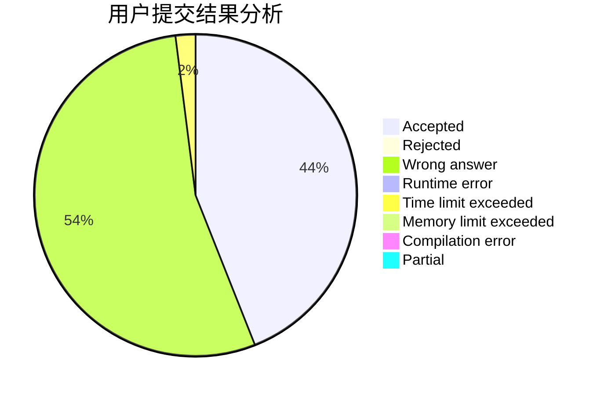
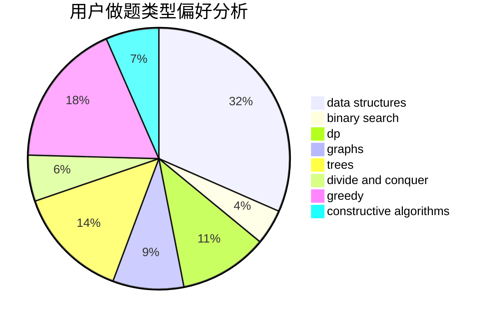
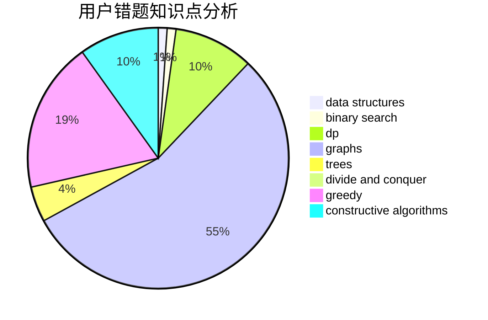

# TraceOnSnow

<!-- tabs:start -->

#### **用户提交结果分析**

#### **用户做题类型偏好分析**

#### **用户错题知识点分析**

<!-- tabs:end -->
# 推荐题目
[799D](https://codeforces.com/contest/799/problem/D)		brute force,
                        dp,
                        meet-in-the-middle		  
[859E](https://codeforces.com/contest/859/problem/E)		combinatorics,
                        dfs and similar,
                        dsu,
                        graphs,
                        trees		  
[949B](https://codeforces.com/contest/949/problem/B)		constructive algorithms,
                        math		  
[600C](https://codeforces.com/contest/600/problem/C)		constructive algorithms,
                        greedy,
                        strings		  
[558A](https://codeforces.com/contest/558/problem/A)		brute force,
                        implementation,
                        sortings		  
[989E](https://codeforces.com/contest/989/problem/E)		dp,
                        geometry,
                        matrices,
                        probabilities		  
[710E](https://codeforces.com/contest/710/problem/E)		dfs and similar,
                        dp		  
[317B](https://codeforces.com/contest/317/problem/B)		brute force,
                        implementation		  
[243B](https://codeforces.com/contest/243/problem/B)		graphs,
                        sortings		  
[1095F](https://codeforces.com/contest/1095/problem/F)		dsu,
                        graphs,
                        greedy		  
