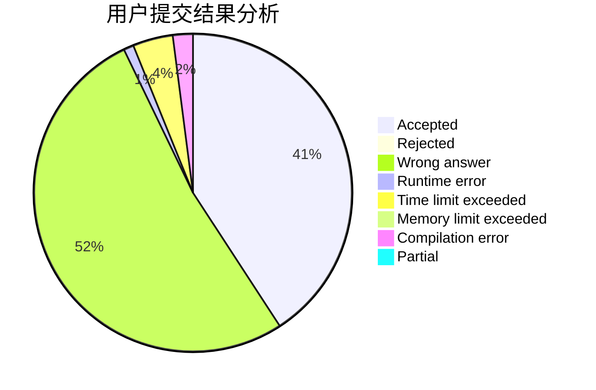
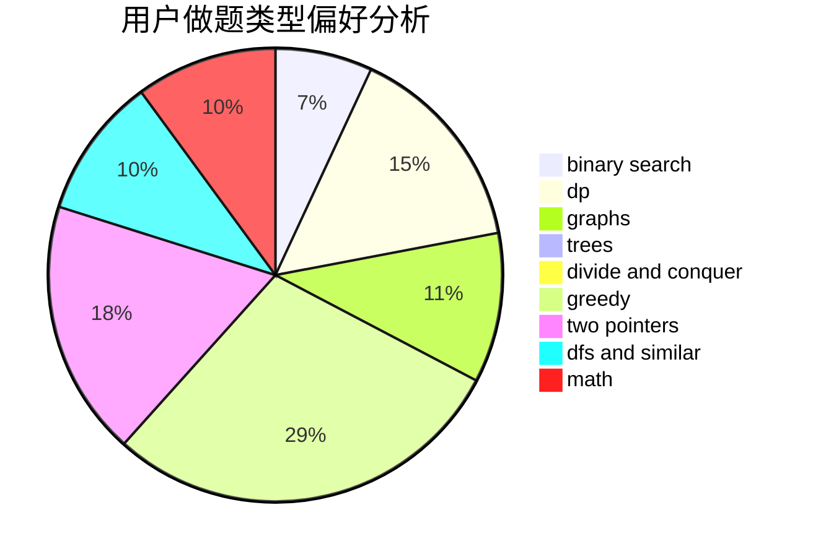

# TreasureQxy

<!-- tabs:start -->

#### **用户提交结果分析**

#### **用户做题类型偏好分析**

<!-- tabs:end -->
# 推荐题目
[575A](https://codeforces.com/contest/575/problem/A)
[1040B](https://codeforces.com/contest/1040/problem/B)
[988C](https://codeforces.com/contest/988/problem/C)
[1432D](https://codeforces.com/contest/1432/problem/D)
[821A](https://codeforces.com/contest/821/problem/A)
[862E](https://codeforces.com/contest/862/problem/E)
[16B](https://codeforces.com/contest/16/problem/B)
[977F](https://codeforces.com/contest/977/problem/F)
[1170E](https://codeforces.com/contest/1170/problem/E)
[173A](https://codeforces.com/contest/173/problem/A)
