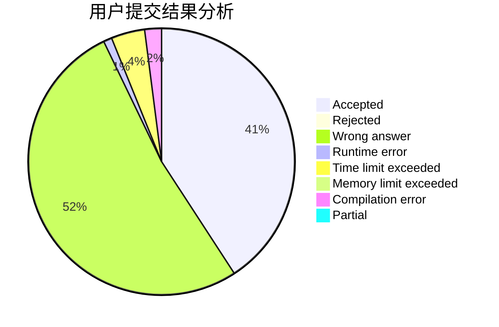
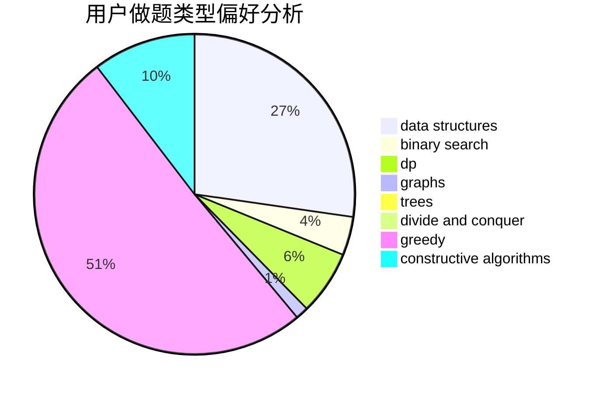

# TreasureQxy

<!-- tabs:start -->

#### **用户提交结果分析**

#### **用户做题类型偏好分析**

#### **用户错题知识点分析**

<!-- tabs:end -->
# 推荐题目
[575A](https://codeforces.com/contest/575/problem/A)		data structures,
                        math,
                        matrices		  
[1040B](https://codeforces.com/contest/1040/problem/B)		dp,
                        greedy,
                        math		  
[988C](https://codeforces.com/contest/988/problem/C)		implementation,
                        sortings		  
[1432D](https://codeforces.com/contest/1432/problem/D)		dsu,graphs,sortings,trees		  
[821A](https://codeforces.com/contest/821/problem/A)		implementation		  
[862E](https://codeforces.com/contest/862/problem/E)		binary search,
                        data structures,
                        sortings		  
[16B](https://codeforces.com/contest/16/problem/B)		greedy,
                        implementation,
                        sortings		  
[977F](https://codeforces.com/contest/977/problem/F)		dp		  
[1170E](https://codeforces.com/contest/1170/problem/E)		*special problem,
                        binary search		  
[173A](https://codeforces.com/contest/173/problem/A)		implementation,
                        math		  
