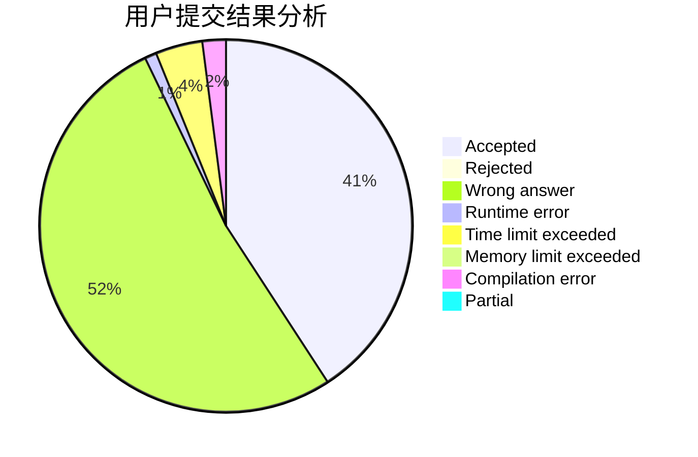
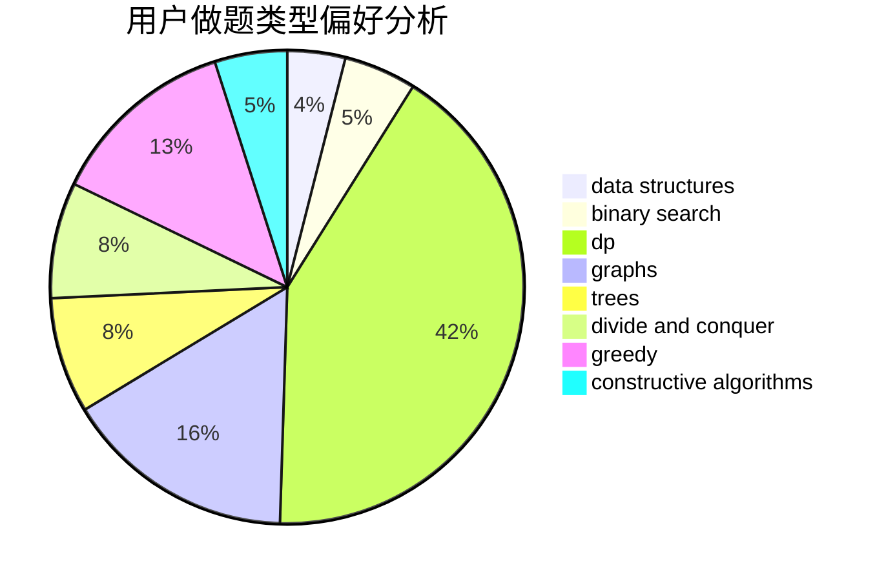

# TreasureQxy

<!-- tabs:start -->

#### **用户提交结果分析**

#### **用户做题类型偏好分析**

#### **用户错题知识点分析**

<!-- tabs:end -->
# 推荐题目
[54A](https://codeforces.com/contest/54/problem/A)		implementation		  
[103D](https://codeforces.com/contest/103/problem/D)		brute force,
                        data structures,
                        sortings		  
[966E](https://codeforces.com/contest/966/problem/E)		dsu,graphs,sortings,trees		  
[1423N](https://codeforces.com/contest/1423/problem/N)		nan		  
[804F](https://codeforces.com/contest/804/problem/F)		combinatorics,
                        dfs and similar,
                        dp,
                        graphs,
                        number theory		  
[843D](https://codeforces.com/contest/843/problem/D)		graphs,
                        shortest paths		  
[1511E](https://codeforces.com/contest/1511/problem/E)		combinatorics,
                        dp,
                        greedy,
                        math		  
[956B](https://codeforces.com/contest/956/problem/B)		dsu,graphs,sortings,trees		  
[1167A](https://codeforces.com/contest/1167/problem/A)		brute force,
                        greedy,
                        strings		  
[1513C](https://codeforces.com/contest/1513/problem/C)		dp,
                        matrices		  
