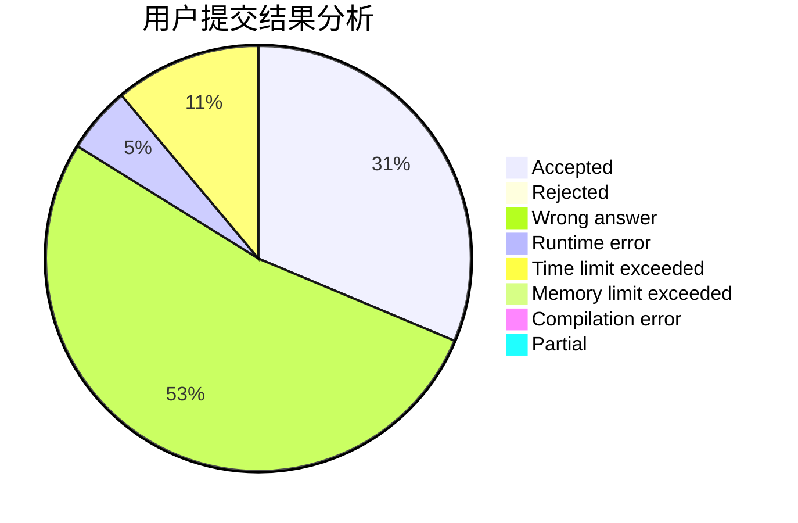
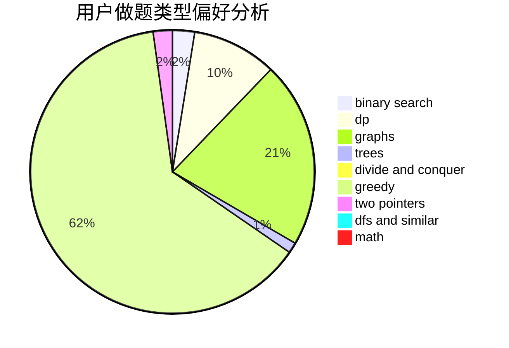

# TrembingFly

<!-- tabs:start -->

#### **用户提交结果分析**

#### **用户做题类型偏好分析**

<!-- tabs:end -->
# 推荐题目
[1504B](https://codeforces.com/contest/1504/problem/B)
[289D](https://codeforces.com/contest/289/problem/D)
[631E](https://codeforces.com/contest/631/problem/E)
[558E](https://codeforces.com/contest/558/problem/E)
[263A](https://codeforces.com/contest/263/problem/A)
[940B](https://codeforces.com/contest/940/problem/B)
[1413C](https://codeforces.com/contest/1413/problem/C)
[876C](https://codeforces.com/contest/876/problem/C)
[357B](https://codeforces.com/contest/357/problem/B)
[520E](https://codeforces.com/contest/520/problem/E)
